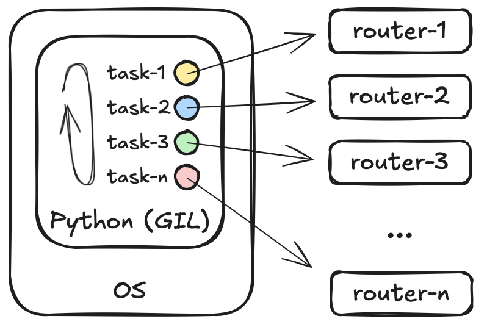
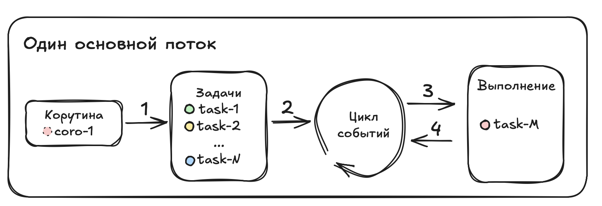
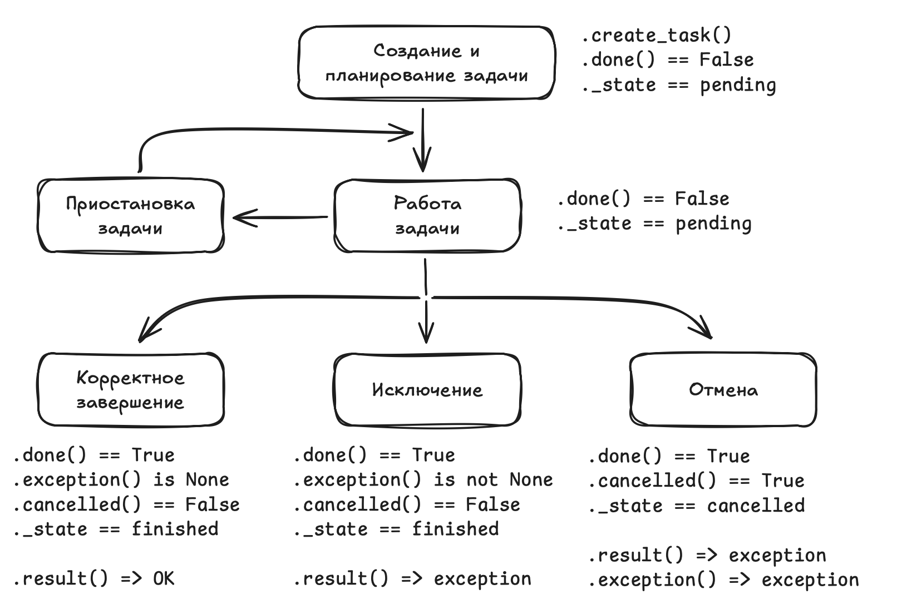

# Асинхронный код

- [Асинхронный код](#асинхронный-код)
  - [Введение](#введение)
    - [Описание](#описание)
    - [Частые ошибки](#частые-ошибки)
    - [Минусы и плюсы](#минусы-и-плюсы)
    - [Схема работы асинхронного приложения](#схема-работы-асинхронного-приложения)
  - [Базовые примитивы](#базовые-примитивы)
    - [`Awaitable` объекты](#awaitable-объекты)
    - [Цикл событий (Event Loop)](#цикл-событий-event-loop)
  - [Быстрый обзор](#быстрый-обзор)
    - [Корутины (Coroutine)](#корутины-coroutine)
    - [Запуск корутин](#запуск-корутин)
    - [Задача (Task)](#задача-task)
    - [`asyncio.create_task()`](#asynciocreate_task)
    - [`asyncio.gather()`](#asynciogather)
    - [`Future`](#future)
    - [`ContextVar`](#contextvar)
  - [Функции asyncio](#функции-asyncio)
    - [`asyncio.run()`](#asynciorun)
    - [`asyncio.sleep()`](#asynciosleep)
    - [Запуск и ожидание корутин](#запуск-и-ожидание-корутин)
      - [`asyncio.create_task()`](#asynciocreate_task-1)
      - [`asyncio.current_task()`](#asynciocurrent_task)
      - [`asyncio.gather()`](#asynciogather-1)
      - [`asyncio.wait_for()`](#asynciowait_for)
      - [`asyncio.wait()`](#asynciowait)
      - [`asyncio.as_completed()`](#asyncioas_completed)
        - [SyncIterator](#synciterator)
        - [AsyncIterator](#asynciterator)
      - [`asyncio.shield()`](#asyncioshield)
      - [`asyncio.timeout()` / `asyncio.timeout_at()`](#asynciotimeout--asynciotimeout_at)
    - [Ручная работа с циклом событий](#ручная-работа-с-циклом-событий)
      - [`asyncio.new_event_loop()`](#asyncionew_event_loop)
      - [`loop.run_until_complete(main())`](#looprun_until_completemain)
      - [`loop.close()`](#loopclose)
      - [`loop.run_forever()`](#looprun_forever)
      - [`asyncio.get_running_loop()`](#asyncioget_running_loop)
    - [Запуск блокирующих задач](#запуск-блокирующих-задач)
      - [`asyncio.to_thread()`](#asyncioto_thread)
      - [`loop.run_in_executor()`](#looprun_in_executor)
  - [Задача (Task)](#задача-task-1)
  - [Группа задач (TaskGroup)](#группа-задач-taskgroup)
  - [`async with`](#async-with)
  - [`async for`](#async-for)
  - [Синхронизация в asyncio](#синхронизация-в-asyncio)
    - [`asyncio.Lock()`](#asynciolock)
      - [Race Condition](#race-condition)
      - [Deadlock](#deadlock)
    - [`asyncio.Queue()`](#asyncioqueue)
    - [`asyncio.Event()`](#asyncioevent)
    - [`asyncio.Condition()`](#asynciocondition)
    - [`asyncio.Semaphore()` / `asyncio.BoundedSemaphore()`](#asynciosemaphore--asyncioboundedsemaphore)
  - [Некоторые библиотеки](#некоторые-библиотеки)
    - [Работа с файлами](#работа-с-файлами)
    - [Прогресс-бар](#прогресс-бар)
    - [HTTP-клиент (aiohttp)](#http-клиент-aiohttp)
      - [Базовое использование](#базовое-использование)
      - [`aiohttp.ClientSession()`](#aiohttpclientsession)
      - [`aiohttp.TCPConnector`](#aiohttptcpconnector)
      - [`aiohttp.ClientTimeout()`](#aiohttpclienttimeout)
      - [`aiohttp.TraceConfig()`](#aiohttptraceconfig)
  - [Материалы](#материалы)

## Введение

### Описание

Одной из библиотекой для реализации асинхронного кода является `asyncio`. Это стандартная библиотека, дополнительно устанавливать ничего не нужно. Название библиотеки полностью отражает её назначение `async` - асинхронное выполнение, `io` - IO-bound операции. Существуют и другие фреймворки для выполнения асинхронных задач (trio, curio и другие), но `asyncio` самый популярный и используемый.

Асинхронный код позволяет реализовать кооперативную многозадачность, в отличии от подхода многопоточность, где реализуется конкурентная многозадачность.

Кооперативная многозадачность, подпрограмма самостоятельно решают когда они могут встать на паузу и отдать процессорное время соседним подпрограммам (в python это определяет сам разработчик). В конкурентной многозадачности за распределение процессорного времени отвечает планировщик операционной системы. При этом асинхронный код работает в одном потоке и на него так же действует GIL и в каждый момент времени может выполнятся только одна инструкция (как и в многопоточном подходе).

Суть асинхронного программирования в том, что IO-bound задачи очень медленные и пока мы ждем ответа от внешней системы мы можем задачу, которая ждет ответа, поставить на паузу, и начать обрабатывать следующую задачу. Когда данные из внешней системы будут получены, управление возвращается первой задачи и она продолжает свою работу.

<p align="center"></p>

Ключевые компоненты, необходимые, что бы обеспечить работу асинхронного кода:

- механизмы оповещения о том, что запрошенные данные получены. Это решается средствами операционной системы и в текущий момент нам не интересны
- выполняемая асинхронная функция должна уметь вставать на паузу пока ждет внешнего ответа. В этом плане такие асинхронные функции очень похожи на функции-генераторы (`yield`), которые так же запоминают своё состояние и встают на паузу до очередного к ним обращения
- как и в случае с функциями-генераторами, которые используют специальную инструкцию `yield` вместо стандартного `return`, асинхронная функция так же должна быть каким-либо образом явно отделена в коде от стандартной последовательной функции. Эта задача решается использованием конструкции `async def` вместо обычного `def` при определении функции. Такие функции называются корутинами (coroutine), так же корутиной называется объект, который получается в результате вызова `async def` функции.
- когда нужно запустить несколько корутин для параллельного исполнения, то на их основе создается задача (task), которые уже попадает на исполнение
- асинхронные функции умеют вставать на паузу в ожидании данных, но это должно происходить в какой-то определенный момент. Нужна языковая конструкция, которая даст понять интерпретатору (и разработчику), что в данном месте кода функция ожидает данных и готова передать ресурсы процессора другим асинхронным функциям. Такой конструкцией является `await`
- нужен некий механизм, контролирующий работу всех задач (созданных из корутин), похожий на диспетчер задач в операционной системе, только внутри python. Такой механизм существует и называется `event loop` (цикл событий)

Часть конструкций появилась в Python v3.4, часть в v3.5 и дальше.

### Частые ошибки

При написании асинхронного кода часто можно столкнуться со следующими ошибками:

- попытка использования корутины как функции. Т.е. создание объекта корутины без её запуска и ожидания. В этом случае python будет выводить предупреждение вида `RuntimeWarning: coroutine '<coro-name>' was never awaited`. Обычно это опечатки в виде забытого `await`
- не использование `await` внутри корутин. Обычно это говорит о том, что эта функция не должна быть корутиной
- использование внутри корутин синхронного кода. Такой подход нивелирует все плюсы использования асинхронного кода
- несмотря на наличие `io` в названии библиотеки, это относится только к асинхронным операциям ввода-вывода. Попытка использовать синхронные библиотеки для реализации IO операций в асинхронном коде является ошибкой

```python
# 00.gen.py
<sys>:0: RuntimeWarning: coroutine 'coro' was never awaited
```

### Минусы и плюсы

Хорошая управляемость: разработчик самостоятельно решает в какой момент можно переключаться между корутинами при помощи `await` (это и есть кооперативная многозадачность) в отличии от многопоточность, где переключение между потоками происходит принудительно планировщиком операционной системы (вытесняющая многозадачность) и разработчик не может на это влиять.

Хорошая управляемость при неправильном использовании может привести к деградации асинхронного кода, когда в корутине будут использоваться блокирующие вызовы или вообще отсутствует использование `await`. Так как цикл событий переключается только в точках, обозначенных через `await` (у него нет принудительного переключения), то попав в такую корутину, цикл событий останется в ней пока её инструкции не закончатся, и переключения между корутинами не будет.

Асинхронный код требует использование специальных асинхронных библиотек/объектов:

- нельзя: `ConnectHandler` (netmiko),  `Scrapli` (scrapli), `requests`, `flask` (ниже 2.0)
- можно: `AsyncScrapli` (scrapli), `httpx` или `aiohttp`, `fastapi`

Корутины дешевле (легковеснее) с точки зрения ресурсов чем потоки. Быстрее создаются и быстрее переключаются. Но ускорение, которое дает asyncio не бесконечно.

Говорить о том, что код на `asyncio` драматично быстрее чем код на `threading` нельзя. Хорошо написанный код будет одинаково быстро работать при использовании любого из подходов и разница в скоростях будет крайне незначительной. Скорость работы не должна быть критерием выбора между асинхронным кодом и многопоточным. Асинхронный код можно выбирать когда нужно самостоятельно настроить места переключения между задачами, когда есть поддержка асинхронного кода со стороны используемых библиотек, когда есть жесткие требования по ресурсам.

### Схема работы асинхронного приложения

Схему работы асинхронного приложения можно представить в следующем виде

<p align="center"></p>

1. создание задач из корутин
2. помещение созданных задач в цикл событий, который отвечает за выполнение запланированных задач
3. передача управления корутине
4. возврат управления корутиной либо из-за приостановки задачи (await), либо при её завершении

Все задачи выполняются в рамках одного потока и цикл событий существует до тех пор, пока существует хотя бы одна запланированная задача. Если все задачи завершились, то цикл событий так же завершает свою работу (в базовом случае) и программа переходит к следующим инструкциям.

## Базовые примитивы

### `Awaitable` объекты

Основные примитивы асинхронного программирования это корутины и задачи - awaitable объекты. Это значит, что такой объект должен использоваться с оператором await.

Иерархия типов выглядит следующим образом

```text
Awaitable
├── Coroutine
├── Future
│   └── Task
└── пользовательские awaitable-объекты
```

Для аннотации можно использовать как конечные Task/Coroutine/Future, так и Awaitable тип.

```python
from asyncio import Task
from collections.abc import Awaitable, Coroutine

# список awaitable объектов (задачи/корутины - не важно), которые возвращают тип str
tasks_and_coros: list[Awaitable[str]] = []

# список корутин, возвращающих str
coros: list[Coroutine[Any, Any, str]] = []

# список задач, возвращающих str
tasks: list[Task[str]] = []
```

### Цикл событий (Event Loop)

Цикл событий - это фундамент асинхронного приложения который управляет выполнением асинхронного кода, обрабатывает события, сетевые операции и другие задачи.

Основные цели:

- координация выполнения асинхронных задач
- обработка событий ввода/вывода (I/O)
- управление асинхронными вызовами и callback-функциями
- управление очередью задач

Основные характеристики:

- однопоточность: работает в одном потоке, но обрабатывает множество задач. Можно создать новый поток и в нем запустить свой цикл событий
- кооперативная многозадачность: задачи самостоятельно отдают контроль через await
- неблокирующий I/O: использует асинхронный ввод/вывод для взаимодействия с ресурсами
- обработка событий: реагирует на события (сетевые запросы, таймеры и т.д.)

Event loop может быть использован из сторонних библиотек. Например `uvloop` вместо стандартного цикла, поставляемого `asyncio`.

## Быстрый обзор

### Корутины (Coroutine)

Корутины - функции (`async def`), которые могут быть приостановлены (`await`) и возобновлены. Приостановка корутин обычно происходит на время ожидания данных от внешних систем или на время выполнения других корутин. Кроме этого корутиной называют объект, полученный при вызове такой функции.

```python
import asyncio

async def coro(num: int) -> None:
    print(f"начало работы корутины '{num}'")
    await asyncio.sleep(num)
    print(f"конец работы корутины '{num}'")
```

`await` можно использовать только внутри корутины, использование `await` в последовательном блоке кода приведет к ошибке.

Для запуска одной корутины из синхронного кода (точка входа) можно использовать `asyncio.run()`

```python
# 01.coro_direct.py
asyncio.run(coro(4))
```

> [!note]
> в asyncio под корутиной понимаются две сущности:
>
> - функция, объявленная через `async def`
> - объект, получаемый при вызове `async def` функции

Асинхронный код подразумевает запуск более одной корутины, поэтому определяется одна корутины (обычно `async def main()`) которая запускается из синхронного кода, а внутри корутины `main()` уже запускаются нужное число корутин.

```python
async def coro(num: int) -> None:
    await asyncio.sleep(num)

async def main() -> str:
    for i in range(1, 6):
        await coro(i)
    return "все корутины выполнены"

if __name__ == "__main__":
    result = asyncio.run(main())
    print(result)
```

> [!note]
> `await` является блокирующей инструкцией, поэтому код в примере выше работает как синхронный (последовательный) и не дает ускорения времени выполнения.

### Запуск корутин

Само по себе создание корутины не означает её запуск для исполнения. Аналогично функциям-генераторам - создание объекта не равно исполнению кода внутри функции.

Есть несколько способов запустить корутину. Запустить корутину значит поместить её в цикл событий для исполнения:

- `await` - самый простой способ. Это ключевое слово приостанавливает работу корутины, внутри которой оно было применено и одновременно с этим запускает другую корутину, результат выполнения которой мы ожидаем в месте применения await. Такой способ запуска является блокирующим, и может применяться только внутри корутин (т.е. внутри async def функций)
- `asyncio.create_task(<coro>)` - метод запускает корутину в существующем цикле событий и возвращает объект `asyncio.Task`. Этот объект позволяет управлять корутиной (останавливать, проверять статус и пр). Такой способ запуска является неблокирующим
- `asyncio.run(<coro>)` - метод создает цикл событий и запускает в нем корутину. Обычно этот метод применяется как точка входа в асинхронный код. Метод блокирующий
- `loop = asyncio.new_event_loop()` + `loop.run_until_complete(<coro>)` - старый вариант запуска основной корутины (точки входа в асинхронный код), сейчас (c py3.7) можно использовать только `asyncio.run`. С другой стороны, создание цикла (старый вариант) дает больший контроль, и в некоторых случаях, когда требуется более тонкая настройка, можно пользоваться им
- `asyncio.gather(<coro1>, <coro2>, ... <coroN>)` - позволяет запустить и получить результаты сразу нескольких корутин (задач) (метод дожидается выполннения всех объектов)
- `asyncio.wait(<coro1>, <coro2>, ... <coroN>)` - так же позволяет запустить и дождаться выполнения всех корутин (задач), дополнительно можно указать условия завершения, например время ожидания, или стратегий ожидания (например ждем кто быстрее завершится, потом все остальные снимаем)
- `asyncio.as_completed(<coro>)` - позволяет запустить корутины (задачи) и возвращать результат по мере их готовности
- еще ряд способов, рассмотрим ниже.

### Задача (Task)

Задачи являются обертками для корутин для конкурентного их выполнения и возможности управления (например остановки/отмены).

Корутина:

- асинхронная функция, объявленная через `async def`
- реализует логику алгоритма
- обозначает точки приостановки (передачи управления) через `await`
- не запускается самостоятельно

Задача:

- обертка над корутиной
- следит за выполнением корутины в рамках цикла событий
- дает возможность управления (например `.cancel()` - снять задачу)
- хранит результат выполнения или исключение

Задачи это объекты класса `asyncio.Task`

### `asyncio.create_task()`

Создавать задачи из корутин можно явно через `asyncio.create_task()` или неявно, например, в `asyncio.gather()` можно передать как уже созданные задачи, так и корутины, которые будут автоматически запущены как задачи для конкурентного выполнения.

```python
async def main() -> str:
    task1 = asyncio.create_task(coro(1))
    task2 = asyncio.create_task(coro(2))
    task3 = asyncio.create_task(coro(3))
    print("задачи созданы")
```

При создании задачи она автоматически попадает в цикл событий.

```python
async def coro(num: int) -> str:
    print(f"начало работы корутины '{num}', {perf_counter() - t0:.3f} сек")
    await asyncio.sleep(num)
    print(f"конец работы корутины '{num}', {perf_counter() - t0:.3f} сек")
    return f"корутина '{num}' выполнена"

async def main() -> None:
    fast = asyncio.create_task(coro(2))
    middle = asyncio.create_task(coro(4))
    slow = asyncio.create_task(coro(6))
    await slow
```

> [!note]
> Стоит помнить, что `async def main()` тоже является корутиной и если в ней отсутствует передача управления через `await`, то это блокирующая задача и передача управления остальным задачам будет осуществлена только по завершению работы main. Для ручного переключения управления можно использовать `await asyncio.sleep(0)` - эта строка передает управление другим задачам, но так как задержка установлена в 0, то ожидания не будет.

### `asyncio.gather()`

```python
async def coro(num: int) -> str:
    print(f"начало работы корутины '{num}', {perf_counter() - t0:.3f} сек")
    await asyncio.sleep(num)
    print(f"конец работы корутины '{num}', {perf_counter() - t0:.3f} сек")
    return f"корутина '{num}' выполнена"


async def main() -> None:
    await asyncio.gather(*[coro(i) for i in range(1, 4)])
    print("---")
    await asyncio.gather(coro(1), coro(2), coro(3))
    print("---")
    tasks = [asyncio.create_task(coro(i)) for i in range(1, 4)]
    await asyncio.gather(*tasks)
```

### `Future`

Футуры еще один класс в asyncio, который представляет ожидаемую задачу. Это низкоуровневый объект, являющийся базовым для Task. Напрямую используется редко, предпочтительно использовать сразу Task, но когда:

- нужно вручную управлять результатом работы корутины
- нужно взаимодействовать с низкоуровневыми API
- старый код

может применяться Future.

```python
async def coro(num: int, fut: asyncio.Future) -> None:
    print(f"начало работы корутины '{num}', {perf_counter() - t0:.3f} сек")
    await asyncio.sleep(num)
    print(f"конец работы корутины '{num}', {perf_counter() - t0:.3f} сек")
    fut.set_result(f"корутина '{num}' выполнена")


async def main() -> None:
    loop = asyncio.get_running_loop()
    future = loop.create_future()

    task = asyncio.create_task(coro(2, future))
    await future
```

Сравнение с Task

| | Future | Task |
| - | - | - |
| Абстракции | Низкая (базовый класс для Task) | Высокая |
| Создание | Вручную | Автоматическое |
| Использование | Редкое | Частое |
| Завершение | Ручное (set_result) | Автоматическое |
| Отмена | Да | Да |

### `ContextVar`

Модуль `contextvars` позволяет создавать переменные `ContextVar`, которые могут иметь разные значения в разных контекстах. Контекст выполнения это механизм, который позволяет хранить данные, специфичные для текущей цепочки выполнения, т.е. в разных корутинах одна и та же переменная может содержать различное значение.

Контекстные переменные используются для:

- изоляции состояний асинхронного приложение - каждый контекст имеет свои экземпляры переменных, что позволяет разграничить данные для разных корутин
- передачи данных между корутинами, без внесения дополнительных параметров в сигнатуры функции

```python
request_id: ContextVar[str] = ContextVar("request_id", default="n/a")
```

Для управления значением переменной доступно три метода:

- `.get([default])` - получить значение, если указать default, то при отсутствии значения, будет возвращено default, иначе будет исключение LookupError
- `.set()` - установить значение
- `.reset()` - сбросить значение

```python
import contextvars

var = contextvars.ContextVar("var", default="default")

print(var.get())  # default

var.set("old-value")
print(var.get())  # old-value

token = var.set("new-value")
print(var.get())  # new_value

var.reset(token)
print(var.get())  # old-value
```

Используется в:

- в web-фреймворках (FastAPI, Django) для обмена request-id между middleware и обработчиками
- в логировании дла добавления request-id в сообщения
- в асинхронных задачах для сохранения контекста для каждой задачи

Главное преимущество — изоляция контекста без явной передачи параметров в функции.

> [!note]
> Контекст задач, запущенных внутри задачи, в которой задается значение контекстной переменной, совпадает с контекстом "родительской" задачи. Т.е. все запускаемые задачи наследуют контекст родительской задачи, откуда они были запущены.

## Функции asyncio

### `asyncio.run()`

Создаёт цикл событий и запускает в нем переданную корутину. После завершения выполнения корутины завершает цикл событий. Функция является основным методом для запуска асинхронного приложения.

`asyncio.run(coro, *, debug=None, loop_factory=None)`

- coro: запускаемая корутина
- debug: запуск в режиме отладки, показывает больше информации по исключениям, долгие выполнения корутин, забытые (не awaited) корутины
- loop_factory: возможность использовать собственную реализацию цикла событий

```python
result = asyncio.run(
    main=main(),
    debug=True,
    loop_factory=uvloop.Loop,
)
```

Особенности:

- создает цикл событий, в котором запускается переданная корутина main. Т.е. в цикле событий всегда есть как минимум одна корутина
- завершает цикл событий, когда завершается main корутина. При этом если в цикле событий есть другие незавершенные корутины, то они удаляются без ожидания завершения их работы
- в потоке может существовать только один работающий цикл событий, поэтому вызов asyncio.run() при уже работающем цикле событий приведет к ошибке. При этом можно вызывать asyncio.run() последовательно (т.е. после завершения работа предыдущего цикла событий)
- нельзя вызывать из корутин (прямое следствие из предыдущего пункта)
- возвращает результат работы корутины main
- пробрасывает исключения в вызывающий код, если где-то внутри main (или порожденных main корутинах) вызвано исключение, то asyncio.run() гарантирует завершение всех корутин и пробрасывает исключение в точку вызова asyncio.run()

### `asyncio.sleep()`

Приостанавливает исполнение текущей корутины, передавая управление циклу событий для обработки других корутин.

`asyncio.sleep(delay, result=None)`

- delay: на сколько приостанавливать (float или int)
- result: значение, которое вернется после завершения задержки

```python
await asyncio.sleep(3)
```

Особенности:

- не блокирует код, а приостанавливает текущую корутину, давая возможность начать выполняться другой корутине
- метод не гарантирует точную задержку
- `await asyncio.sleep(0)` используется для переключения между корутинами

### Запуск и ожидание корутин

#### `asyncio.create_task()`

Функция создает объект Task из переданной корутины и отправляет задачу в цикл событий.

`asyncio.create_task(coro, *, name=None, context=None)`

- coro: корутина
- name: имя задачи
- context: контекст выполнения

```python
tasks = [
    asyncio.create_task(
        coro=coro(i),
        name=f"my-task-{i}",
        context=contexts[i],
    )
    for i in range(len(contexts))
]
```

Особенности:

- при создании задача планируется к выполнению, но не начинает выполняться сразу
- созданную задачу нужно ожидать через await, asyncio.gather() или другими функциями
- функция создает объекты Task, которые можно записывать в переменные, списки, использовать в циклах и пр
- используется только внутри асинхронной функции, и создает задачу в уже существующем цикле событий
- задачи можно отменять

Есть аналогичная функция `asyncio.ensure_future()`, которая является устаревшей, но может встречаться в коде. Есть некоторые отличия create_task, но в целом выполняет ту же самую работу.

#### `asyncio.current_task()`

В корутине можно получить задачу, в рамках которой корутина выполняется и взаимодействовать с этим объектом.

```python
task_name = asyncio.current_task().get_name()
```

#### `asyncio.gather()`

Ставит awaitable-объекты в очередь на выполнения. Возвращает Future, которую нужно ожидать. Это значит, что можно создать несколько Future, и их, в свою очередь, опять передать в asyncio.gather().

`asyncio.gather(*aws, return_exceptions=False)`

- aws: последовательность awaitable объектов
- return_exceptions: рассматривает исключение в корутине как результат выполнения, а не пробрасывает наверх

Особенности:

- автоматически оборачивает корутины в задачи
- возвращает результаты в том порядке, в котором они были переданы
- меняя значение return_exceptions можно управлять тем, рассматривать ли исключение как результат корутины или нет
- нет ограничений на количество запускаемых задач. Вычислительные ресурсы ограничены, а в gather можно передать сколько угодно корутин. Для ограничения нужно использовать дополнительные примитивы  (например семафор)

#### `asyncio.wait_for()`

Функция ожидает корутину заданное количество времени. Если корутина не завершилась за указанное время, то она снимается, и бросается исключение TimeoutError.

`asyncio.wait_for(aw, timeout)`

- aw: awaitable объект (если корутина, то будет обернута в задачу, как и в случае применения gather)
- timeout: время, в течении которого, ожидаем завершения корутины. Если таймаут завершился, то в точку вызова wait_for бросается исключение TimeoutError

Особенности:

- работает с одним awaitable объектом, т.е. вместо простого await, которое не позволяет задать максимальное время ожидания ответа, можно использовать wait_for
- возвращает то же значение, что и завершенная задача
- отмена работающей корутины происходит через asyncio.CancelledError, поэтому важно, что бы работающая корутина не экранировала это исключение

#### `asyncio.wait()`

Функция запускает группу задач (как gather), но позволяет задать время ожидания этой группы (как wait_for, но не для одной корутины, а для запущенной группы).

`asyncio.wait(fs, *, timeout=None, return_when=asyncio.ALL_COMPLETED)`

- fs: итерируемый объект с задачами или футурами. В отличии от gather, тут передается именно итерируемый объект, его не нужно распаковывать, кроме этого, корутины функция не принимает
- timeout: время, в течении которого, ожидаем завершения группы корутин
- return_when: определяет стратегию, когда wait() возвращает управления в точку вызова
  - ALL_COMPLETED (по умолчанию) - ждет завершения всех корутин, потом возвращает управление
  - FIRST_COMPLETED - возвращает управление, как только любая корутина будет завершена (или отменена)
  - FIRST_EXCEPTION - возвращает управление, как только любая из корутин завершится с исключением. Если таких нет, то поведение такое же, как при ALL_COMPLETED

функция возвращает кортеж `(done, pending)`

- done: завершенные корутины
- pending: незавершенные корутины на момент return_when. Если стратегия была ALL_COMPLETED, то pending должен быть пустым

```python
done, pending = await asyncio.wait(
    fs=[asyncio.create_task(coro(i)) for i in range(1, coro_count + 1)],
    timeout=timeout,
    return_when=asyncio.ALL_COMPLETED,
)
```

Особенности:

- pending содержит корутины, которые не завершены, но wait не делает cancel() этих корутин. Т.е. они остаются в цикле событий и если дальше по коду будет await, то есть шанс завершения корутин из списка pending
- функция wait не вызывает исключение TimeoutError, как wait_for, а просто возвращает управление в корутину, где была вызвана
- функция не принимает корутины. Только задачи или футуры

#### `asyncio.as_completed()`

Позволяет получать результаты корутин по мере их завершения, а не ждать всю группу целиком. Возвращает итератор по Future-объектам, гда каждая очередная футура представляет собой завершившуюся задачу.

```python
for task in asyncio.as_completed(
    fs=[asyncio.create_task(coro()) for _ in range(3)],
    timeout=timeout,
):
```

`asyncio.as_completed(fs, *, timeout=None)`

- fs: итерируемый объект с задачами или футурами. В отличии от gather, тут передается именно итерируемый объект, его не нужно распаковывать, кроме этого, корутины функция не принимает
- timeout: время, в течении которого, ожидаем завершения группы корутин

Особенности:

- функция возвращает либо синхронный либо асинхронный итератор, в зависимости от этого поведение разное

##### SyncIterator

Синхронный итератор используется с конструкцией `for task in asyncio.as_completed()`. При этом на каждой итерации:

- создается отдельная футура, в которую попадет очередная завершившаяся задача
- созданную футуру нужно ожидать (await)
- если завершившаяся корутина завершилась исключением, то оно бросается в месте ожидания футуры, т.е. в месте, где происходит await и в блок try/except нужно оборачивать именно await футуры

```python
for task in asyncio.as_completed(
    fs=[asyncio.create_task(coro()) for _ in range(3)],
    timeout=timeout,
): 
    # тут task это футура на будущий результат первой завершившейся корутины
    # т.е. в этом месте task еще не связан ни с каким-либо конкретным результатом
    try:
        # тут await отдает управление циклу событий и остальные корутины получают возможность
        # исполниться. результат очередной завершившейся корутины попадет в переменную result
        # и цикл событий вернет управление в этот код. Если корутина завершилась из-за исключения,
        # то оно пробрасывается в эту точку (await), поэтому await обернут в try/except
        result = await task 
    except TimeoutError:
        # TimeoutError для корутин, которые не успели завершится за заданное таймаутом временем
        print("timeout!!!")
    except ZeroDivisionError:
        # другие исключения, которые могут встретиться в теле корутины
        print("деление на ноль!!!")
    else:
        print(result)
```

##### AsyncIterator

Асинхронный итератор используется с конструкцией `async for task in asyncio.as_completed()`. При этом на каждой итерации:

- отдельная футура не создается, а в переменную попадает сама завершившаяся задача. Т.е. в отличии от синхронного итератора, дополнительной промежуточной футуры не создается.
- в теле цикла у задачи сразу можно получать результат через .result(), либо await (что то же самое для завершенных задач)
- если задачи не успели завершится за заданное время, то они не снимается автоматически. Если требуется снять такие задачи, то это нужно сделать после цикла. Поведение аналогично поведению функции wait.

```python
tasks = [asyncio.create_task(coro(i)) for i in range(1, coro_count + 1)]
# в try/except оборачивается весь цикл для поимки TimeoutError
try:
    async for task in asyncio.as_completed(
        fs=tasks,
        timeout=timeout,
    ):
        # тут task это первый завершившийся объект из списка tasks, а не дополнительная футура
        # для завершенных задач await task то же самое, что и task.result()
        # для получения результат либо оборачиваем в try/except блок, либо через .exception 
        # проверяем исключение
        try:
            print(task.result())
        except ZeroDivisionError as exc:
            print(str(exc))
# для обработки исключения, которое возникает при таймауте
except ZeroDivisionError as exc:
    print(str(exc))

# задачи, которые не успели завершиться за отведенное время нужно снимать самостоятельно
for task in tasks:
    if not task.done():
        task.cancel()
```

#### `asyncio.shield()`

Защищает корутину или задачу от отмены. Создаёт обёртку вокруг задачи, которая экранирует запросы на отмену. При этом код, ожидающий такую задачу (await), всё равно получит CancelledError, но защищённая задача продолжит работу в фоне.

```python
task = asyncio.create_task(coro())
shielded_task = asyncio.shield(task)
shielded_task.cancel()
try:
    await shielded_task
except asyncio.exceptions.CancelledError:
    print("попытка отмена задачи")
    await task
```

- shield защищает задачу от отмены, не не защищает ожидание результата
- позволяет внешнему коду реагировать на попытку отмены

#### `asyncio.timeout()` / `asyncio.timeout_at()`

В 3.11 появился новый способ управления временным ограничением для выполняемых задач. Преимущества над остальными вариантами:

- работа в режиме контекстного менеджера
- работа с другими асинхронными конструкциями
- возможность управлять таймером (продлять/отменять)

В `.timeout()` указывается относительное время, в `.timeout_at()` - абсолютное (можно получить как `asyncio.get_running_loop().time()`). В остальном эти функции одинаковые.

```python
tasks = [asyncio.create_task(coro()) for _ in range(3)]
try:
    async with asyncio.timeout(2.5):
        await asyncio.gather(*tasks, return_exceptions=True)
except TimeoutError:
    print("таймаут выполнения задач")
```

### Ручная работа с циклом событий

Предпочтительный способ запуска цикла событий является `asyncio.run()`, но в старом коде или сложных ситуаций, требующих точного контроля/настройки, можно создавать и запускать цикл событий вручную.

#### `asyncio.new_event_loop()`

Функция создает новый цикл событий.

#### `loop.run_until_complete(main())`

Метод созданного цикла, с помощью которого запускается корутина, передаваемая как аргумент.

#### `loop.close()`

После завершения цикл обязательно закрывается.

```python
loop = asyncio.new_event_loop()
try:
    loop.run_until_complete(main())
finally:
    loop.close()
```

#### `loop.run_forever()`

Запускает бесконечный цикл событий, который не завершается после завершения работы корутин. Требует ручной остановки `loop.stop()` и закрытия `loop.close()`. Подходит для долгоживущих задач, которые должны работать непрерывно (серверы, боты, фоновые службы и пр), для разовых задач (выполнить запрос и закончить) подходит `loop.run_until_complete()`

```python
async def check_status(loop: asyncio.AbstractEventLoop) -> None:
    filename = Path("shutdown")
    while True:
        await asyncio.sleep(2)
        if filename.is_file():
            print("завершаем цикл")
            await shutdown(loop)
            return
        print("завершение цикла не требуется")

async def shutdown(loop: asyncio.AbstractEventLoop) -> None:
    tasks = [t for t in asyncio.all_tasks(loop) if t is not asyncio.current_task(loop)]
    for task in tasks:
        task.cancel()
    await asyncio.gather(*tasks, return_exceptions=True)
    loop.stop()

if __name__ == "__main__":
    loop = asyncio.new_event_loop()
    try:
        loop.create_task(check_status(loop))
        loop.create_task(main(coro_count=3))
        loop.run_forever()
    except KeyboardInterrupt:
        print("Принудительная остановка")
        loop.run_until_complete(shutdown(loop))
    finally:
        loop.close()
```

#### `asyncio.get_running_loop()`

Функция возвращает текущий цикл событий. Есть устаревший менее строгий аналог `asyncio.get_event_loop()`, в зависимости от версии python может создать цикл событий, если он отсутствует либо бросить исключение. Предпочтительно использовать`asyncio.get_running_loop()`, который всегда бросает исключение, если цикла нет.

```python
loop = asyncio.get_running_loop()
```

### Запуск блокирующих задач

Достаточно часто в async приложении необходимо запускать классические блокирующие функции. Если такая функция является тяжелой и может заблокировать цикл, то такую задачу можно выгрузить в отдельный поток (процесс). Такая необходимость может возникнуть, например:

- тяжелая CPU bound задача, например вычисления
- блокирующие операции IO, например чтение файла
- работа с библиотеками, которые не поддерживают async

Для выполнения блокирующей функции в отдельном потоке можно использовать

- `asyncio.to_thread()` — новый (py3.9) и более простой, высокоуровневый подход
- `loop.run_in_executor()` — старый, более гибкий, низкоуровневый API (лежит в основе .to_thread)

#### `asyncio.to_thread()`

- современный подход, доступен с py3.9
- простой синтаксис: `await asyncio.to_thread(func, *args, **kwargs)`
- внутри используется loop.run_in_executor() с ThreadPoolExecutor
- используется когда есть блокирующая функция и нужно её вызвать без каких-либо "тонких" настроек

#### `loop.run_in_executor()`

- более старый механизм, доступен с py3.4
- синтаксис `loop.run_in_executor(executor, func, *args)`
- возвращает Future, не может быть обернута в create_task
- можно управлять пулом (или использовать ProcessPoolExecutor вместо ThreadPoolExecutor)
- используется, когда нужно управлять пулом потоков вручную, или запускать в процессах, а не потоках
- используется старый код, где нет asyncio.to_thread()

## Задача (Task)

Существуют несколько состояний задачи:

- PENDING: задача создана и ждет завершения
- FINISHED: задача завершена
- CANCELLED: задача отменена

Для проверки состояния и получения результата существуют методы:

- `.done()`: возвращает `True` если задача завершена (состояния finished или cancelled)
- `.cancelled()`: возвращает `True` если задача отменена (состояние cancelled)
- `.exception()`: в зависимости от ситуации:
  - задача корректно завершилась - возвращает None
  - внутри задачи возникло исключение - возвращает исключение
  - задача отменена - вызывает исключение `CancelledError`
  - задача еще не завершена - вызывает исключение `InvalidStateError`
- `.result()`: в зависимости от ситуации:
  - задача корректно завершена - возвращает результат
  - внутри задачи возникло исключение - вызывает это исключение
  - задача отменена - вызывает исключение `CancelledError`
  - задача еще не завершена - вызывает исключение `InvalidStateError`

Жизненный цикл задачи можно представить как
<p align="center"></p>

- при корректном завершении:
  - результат задачи можно получить через метод `task.result()`, либо сделав `await task`
  - `.exception()` возвращает None
- при завершении с исключением попытка получить результат через `task.result()` или `await task` приведет к возбуждению исключения, с которым завершилась задача
- при отмене задачи получить результат задачи или исключение приведет к возбуждению исключения `asyncio.exceptions.CancelledError`

Кроме этого другие полезные методы:

- `.get_name()` / `.set_name()` - получить / установить имя задачи
- `.get_context()` - получить контекст, в который связан с задачей
- `asyncio.current_task()` - получить текущую запущенную задачу
- `asyncio.all_tasks()` - множество еще незавершенных задач

Обработка результатов может выглядеть следующим образом:

```python
try:
    async for task in asyncio.as_completed(fs=tasks, timeout=timeout):
        try:
            await task
            # result = task.result()
        except asyncio.exceptions.CancelledError:
            print("задача отменена")
        except Exception:
            print("задача завершена с исключением")
        else:
            print("задача завершена корректно без исключений")
except TimeoutError as exc:
    print("время выполнения истекло")
    for task in tasks:
        if not task.done():
            print("задача не успела завершится")
            task.cancel()
```

## Группа задач (TaskGroup)

В 3.11 введен новый класс `asyncio.TaskGroup` для удобного управления группами задач, совмещающий функциональность create_task и gather и дающий ряд дополнительных функций. TaskGroup предоставляет асинхронный менеджер контекста и он является приоритетным способом работы с TaskGroup. При выходе из ,блока менеджера контекста вызывается метод \_\_aexit\_\_, который ожидает все задачи, созданные внутри блока.

```python
async with asyncio.TaskGroup() as tg:
    tasks = [tg.create_task(coro()) for _ in range(3)]

for task in tasks:
    print(task.result())
```

Внутри блока можно использовать все механизмы взаимодействия с задачами, например обрабатывать исключения, ожидать отдельные задачи, не выходя из блока, и прочее.

```python
async with asyncio.TaskGroup() as tg:
    tasks = [
        tg.create_task(coro(1)),
        task1 := tg.create_task(coro(2)),
        task2 := tg.create_task(coro(3)),
        tg.create_task(coro(4)),
    ]
    await task1
    task2.cancel()
```

> [!warning]
> TaskGroup автоматически отменяет все задачи, если любая из них завершается с ошибкой кроме `CancelledError`.

При возникновении исключения группа задач отменяет оставшиеся задачи и ожидает их завершения, а исключения добавляются в ExceptionGroup.

```python
try:
    async with asyncio.TaskGroup() as tg:
        tasks = [tg.create_task(coro(i), name=f"coro-{i}") for i in range(1, coro_count + 1)]
        tasks.extend(tg.create_task(exc_coro(i), name=f"exc-coro-{i}") for i in (2, 3))
except* ValueError as gexc:
    for exc in gexc.exceptions:
        print(f"ERROR: {exc.__class__.__name__}: {str(exc)}")

for task in tasks:
    print("-" * 10)
    print(f"name: {task.get_name()}")
    print(f"done: {task.done()}")
    print(f"cancelled: {task.cancelled()}")
    try:
        print(f"result: {task.result()}")
    except asyncio.CancelledError:
        print("result: <отсутствует, задача отменена>")
    except Exception as exc:
        print(f"result: <отсутствует, исключение {exc.__class__.__name__}: {str(exc)}>")
```

## `async with`

Асинхронный контекстный менеджер это синхронный вариант конструкции `with ... as ...:` и аналогично реализуется методами

- `__aenter__` - async вариант `__enter__`
- `__aexit__` - async вариант `__exit__`

Асинхронный контекстный менеджер может быть использован только внутри корутин (async def), а синхронный вариант можно применять как в корутинах, так и в последовательных функциях. При применении внутри корутин разница между двумя типами контекстных менеджеров проявляется только в том случае, если в методах входа/выхода присутствуют операции, которые могут блокировать цикл событий.

```python
async with async_context_manager() as cm:
    # действия в рамках контекстного менеджера
```

Вариант 1: нет долгих блокирующих операций - оба контекстных менеджера дают одинаковый эффект:

```python
class SyncAsyncContextManager:
    def __enter__(self) -> Self:
        print("вход в sync контекст")
        return self

    def __exit__(self, exc_type, exc_val, exc_tb) -> Literal[False]:
        print("выход из sync контекста")
        return False

    async def __aenter__(self) -> Self:
        print("вход в async контекст")
        return self

    async def __aexit__(self, exc_type, exc_val, exc_tb) -> Literal[False]:
        print("выход из async контекста")
        return False
```

При таком варианте использование `async with SyncAsyncContextManager() as cm:` и `with SyncAsyncContextManager() as cm:` равнозначно, так как вход/выход "ничего не стоят" и происходят без передачи управления циклу событий.

Вариант 2: есть долгие блокирующие CPU-bound вычисления - оба контекстных менеджера дают одинаковый эффект:

```python
class SyncAsyncContextManager:
    OPS_COUNT = 100_000_000
    def __enter__(self) -> Self:
        for i in range(self.OPS_COUNT):
            _ = i * i % 12345
        print("вход в sync контекст")
        return self

    def __exit__(self, exc_type, exc_val, exc_tb) -> Literal[False]:
        print("выход из sync контекста")
        return False

    async def __aenter__(self) -> Self:
        for i in range(self.OPS_COUNT):
            _ = i * i % 12345
        print("вход в async контекст")
        return self

    async def __aexit__(self, exc_type, exc_val, exc_tb) -> Literal[False]:
        print("выход из async контекста")
        return False
```

Происходит потому, что внутри `__aenter__` нет передачи управления циклу событий, поэтому работа `__aenter__` такая же, как и `__enter__`, и в этом моменте асинхронный код блокируется. Если все таки-нужно выполнять тяжелые вычисления при входе/выхода из контекста, то можно реализовать их таким образом, что бы через `await asyncio.sleep(0)` переключаться на другие корутины, для примера выше это можно делать каждые N итераций цикла.

```python
async def __aenter__(self) -> Self:
    for i in range(self.OPS_COUNT):
        _ = i * i % 12345
        if i % 10_000 == 0:
            await asyncio.sleep(0)
    log("вход в async контекст")
    return self
```

Вариант 3: есть долгие IO-bound операции, которые можно реализовать как корутины и использовать await (например установление сессии с устройством, получение информации через API и пр). В этом случае использование `async with` является правильным подходом, потому что не блокирует код на время ожидания завершения IO операций.

```python
class SyncAsyncContextManager:
    def open(self) -> None:
        time.sleep(5)

    async def aopen(self) -> None:
        await asyncio.sleep(5)

    def __enter__(self) -> Self:
        self.open()
        print("вход в sync контекст")
        return self

    def __exit__(self, exc_type, exc_val, exc_tb) -> Literal[False]:
        print("выход из sync контекста")
        return False

    async def __aenter__(self) -> Self:
        await self.aopen()
        print("вход в async контекст")
        return self

    async def __aexit__(self, exc_type, exc_val, exc_tb) -> Literal[False]:
        print("выход из async контекста")
        return False
```

## `async for`

Асинхронный аналог цикла for, который используется для итерации по асинхронным итерируемым объектам (async iterables) в корутинах.

- работает только внутри корутин (асинхронный функций, определенных через async def)
- может отдавать управление циклу событий пока ожидает готовность следующего элемента
- используется с асинхронными генераторами и асинхронными итераторами

Для реализации асинхронного итератора применяются методы

- `__aiter__` - возвращает асинхронный итерируемый объект (аналог `__iter__`)
- `__anext__` - возвращает очередной объект из асинхронного итератора (аналог `__next__`)
- `StopAsyncIteration` - исключении при исчерпании итератора (аналог `StopIteration`)

```python
async for item in async_iterable:
    # действия с очередным item
else:
    # опциональные действия после завершения итератора
```

Асинхронный генератор реализуется как и синхронный - через yield, но определяется как асинхронная функция.

```python
async def devices(self) -> AsyncGenerator[str]:
    # какой-то код
    yield device
```

## Синхронизация в asyncio

Базовые примитивы синхронизации в asyncio решают различные задачи синхронизации, например контроль доступа к общим ресурсам, ограничения максимального числа одновременно выполняемых корутин, обмен информацией между корутинами и другие задачи. Это ключевые инструменты, которые помогают организовать логику взаимодействия между корутинами.

- `asyncio.Lock()` - механизм, обеспечивающий эксклюзивный доступ к общему ресурсу (mutual exclusion)
- `asyncio.Queue()` - очереди, которые обеспечивают безопасный обмен данными между асинхронными задачами
- `asyncio.Event()` - позволяет одной или нескольким корутинам ждать, пока не произойдет какое-то событие
- `asyncio.Condition()` - комбинирует функциональность Lock() и Event() и применяется когда нужна более сложная логика синхронизации между задачами
- `asyncio.Semaphore()` - позволяет ограничить доступ к общему ресурсу заданному количеству задач
- `asyncio.BoundedSemaphore()` - аналог `Semaphore`, но ограничение не может быть изменено после создания
- `asyncio.Barrier()` - позволяющий блокировать выполнение до тех пор, пока до барьера не дойдет заданное количество задач

### `asyncio.Lock()`

#### Race Condition

В асинхронном коде гонка возникают из-за конкуренции за общее состояние/ресурс, когда несколько потоков (или корутин) пытаются одновременно менять одни и те же данные. Возможные решения — атомарность, блокировка или транзакция.

- атомарность - операция выполняется целиком или не выполняется вообще (промежуточных состояний нет)
- блокировка (mutex - mutual exclusion) - механизм, запрещающий одновременное использование ресурса
- транзакция - группа операций, выполняемая как единое целое (все успешно или откат)

Для реализации mutex в asyncio можно использовать механизм блокировки `asyncio.Lock()` - примитив синхронизации, который обеспечивает эксклюзивный доступ к общему ресурсу в конкурентных корутинах.

Используется для:

- Защиты общих ресурсов от одновременного доступа
- Предотвращения состояния гонки (race conditions)
- Обеспечения последовательного выполнения критических блоков кода

Методы:

- `acquire()` - запрашивает блокировку
  - если блокировка свободна - захватывает её
  - если блокировка занята - ожидает её освобождения (цикл событий не блокируется при этом)
- `release()` - освобождает блокировку
  - должен быть вызван той же корутиной, что и захватила блокировку

```python
lock = asyncio.Lock()

async def action_under_lock():
    # установка блокировки
    await lock.acquire()
    try:
        # критический код
    finally:
        # снятие блокировки
        lock.release()
```

Вместо явного захвата/освобождения рекомендуется использовать:

```python
async with lock:
    # критический блок
```

#### Deadlock

Ситуация, при которой несколько задач находятся в состоянии ожидания ресурсов, занятых друг другом. Такая ситуация может произойти в некоторых случаях, например:

- две корутины ждут выполнения друг друга
- неправильное использование/освобождение блокировок

Возникновение deadlock чаще всего это проблема в проектировании взаимодействия, и решается пересмотром логики. В качестве защитного механизма (но не решения), можно использовать таймауты.

### `asyncio.Queue()`

Очередь - это абстрактный тип данных, который позволяет корутинам обмениваться данными внутри цикла событий. Поддерживает две основные операции:

- добавление элемента в очередь (enqueue)
- извлечение элемента из очереди (dequeue)

asyncio предоставляет три вида очередей:

- `asyncio.Queue` - FIFO очередь
- `asyncio.LifoQueue` - LIFO очередь
- `asyncio.PriorityQueue` - PQ очередь, данные извлекаются (get) в порядке приоритета. Передаются (put) в виде кортежа `(priority, data)`, например `(2, response)`. Чем меньше число, тем выше приоритет. Данные с одинаковым приоритетом извлекаются как FIFO. Кроме кортежей с приоритетами можно передавать только данные, но для них должны поддерживаться операции сравнения.

При создании очереди, можно указать её размер (0 - неограниченная, значение по-умолчанию)

```python
queue = asyncio.Queue(maxsize=0)
```

Если установлен maxsize, то при заполнении очереди корутины, которые пытаются положить данные, будут ждать, когда освободится место (потребитель извлечет данные).

Основные методы:

- `await queue.put()`  
    добавляет данные в очередь. Если очередь заполнена (maxsize), то корутина будет ждать, пока не освободится место.
- `queue.put_nowait()`  
    Добавляет данные в очередь без передачи управления (нет await). Если очередь заполнена, то бросает исключение `exception asyncio.QueueFull`.
- `item = await queue.get()`  
    Извлекает и возвращает элемент из очереди. Если очередь пуста, то корутина ждет поступления данных в очередь.
- `item = queue.get_nowait()`  
    Извлекает и возвращает элемент из очереди. В отличии о `get` если очередь пустая не ждет, а бросает исключение `asyncio.queues.QueueEmpty`
- `queue.task_done()`  
    Уменьшает счетчик незавершенных задач, вызывается после успешной обработки очередного элемента из очереди.
- `await queue.join()`  
    Блокируют выполнение, пока счетчик незавершенных задач не станет нулевым. У объекта очереди есть внутренний счетчик `_unfinished_tasks`, который увеличивается при каждом `put()` и уменьшается при каждом `task_done()`.
- `queue.qsize()`  
    Возвращает текущее количество элементов в очереди.
- `queue.shutdown()`  
    Завершает работу очереди, при попытке сделать `get()` / `put()` на завершенной очереди будет брошено исключение `asyncio.queues.QueueShutDown`.

### `asyncio.Event()`

Позволяет одной или нескольким корутинам ждать, пока не произойдет какое-то событие. Грубо говоря, представляет собой флаг, установка которого в значение True является сигналом для корутин, которые ожидают данного события.

```python
event = asyncio.Event()
```

Основные методы:

- `await event.wait()`
    блокирует выполнение корутины до наступления события
- `event.set()`  
    устанавливает событие
- `event.clear()`  
    сбрасывает событие для повторного использования
- `event.is_set()`  
    Возвращает True если событие установлено, False - если нет

### `asyncio.Condition()`

Позволяет корутинам ожидать изменения состояния и уведомлять друг друга об этом. Сочетает функциональность захвата ресурсов asyncio.Lock с возможностью ожидания и уведомления asyncio.Event.

При создании можно отдельно передать Lock, если создается несколько conditions, но им нужен один и тот же lock.

```python
condition = asyncio.Condition(lock: Lock | None = None)
```

Основные методы:

- `await condition.acquire()` - захватывает условие
- `condition.release()` - освобождает условие
- `async with condition` - лучше использовать вместо ручного acquire / release
- `await condition.wait()` - ожидает уведомления. Освобождает блокировку на время ожидания, и обратно забирает когда уведомление получено
- `await condition.wait_for(predicate)` - ожидает, пока корутина predicate не станет истиной
- `condition.notify(n=1)` - уведомляет n ожидающих задач
- `condition.notify_all()` - уведомляет все ожидающие задачи

### `asyncio.Semaphore()` / `asyncio.BoundedSemaphore()`

Позволяет ограничить количество задач, которые могут захватить блокировку. Работает как счетчик, который уменьшается каждый раз, когда задача начинает использовать общий ресурс и увеличивается, когда задача заканчивает использование ресурса. Если счетчик достигает нуля, новые задачи должны ждать, пока не уже работающие задачи не закончат работу и не освободят ресурс.

```python
semaphore = asyncio.Semaphore(value=1)
semaphore = asyncio.BoundedSemaphore(value=1)
```

Основные методы

- `semaphore.acquire()` - захватывает семафор (уменьшает счетчик)
- `semaphore.release()` - освобождает семафор (увеличивает счетчик). Метод можно вызывать много раз, вне зависимости от того, был ли acquire. Метод увеличивает внутренний счетчик, что можно использовать для динамической настройки максимального порога.
- `semaphore.locked()` - возвращает True, если семафор нельзя захватить немедленно
- `async with semaphore` - лучше использовать вместо ручного acquire / release

BoundedSemaphore является оберткой над Semaphore, единственным отличием которого является то, что нельзя увеличить заданный порог многократным вызовом `release()`

## Некоторые библиотеки

### Работа с файлами

Последовательное чтение нескольких файлов блокирует цикл событий и не дает выполняться другим корутинам пока все файлы не будут прочитаны.

```python
async def read_files(files: list[Path]) -> None:
    for file in files:
        with open(file, "r") as f:
            _ = f.read()
```

Для работы с файлами в асинхронном коде можно применять несколько подходов (актуально не только для работы с файлами, но и для остальных блокирующих синхронных операций):

- использовать блокирующее чтение, но на каждой итерации цикла отдавать управление, давая возможность другим корутинам работать

    ```python
    async def read_files(files: list[Path]) -> None:
        for file in files:
            await asyncio.sleep(0)  # пробуем передать управление другим корутинам
            with open(file, "r") as f:
                _ = f.read()
    ```

- выгружать чтение файлов в отдельные потоки

    ```python
    def _read_file_thread(file: Path) -> None:
        with open(file, "r") as f:
            _ = f.read()

    async def read_file_thread(files: list[Path]) -> None:
        loop = asyncio.get_event_loop()
        tasks = []
        with ThreadPoolExecutor(max_workers=5) as pool:
            for file in files:
                task = loop.run_in_executor(pool, _read_file_thread, file)
                tasks.append(task)
            await asyncio.gather(*tasks)
    ```

- выгружать чтение файлов в отдельные процессы. Так как процессы не разделяют память, нужно отдельно делать обмен данными. Но у процессов разный GIL, поэтому они не блокируют друг друга. С т.з. кода отличается только заменой ThreadPoolExecutor > ProcessPoolExecutor. Так же могут потребоваться дополнительные инструменты для обмена данными между процессами (например передача глобальных констант), если получение результата через return не достаточно.

    ```python
    async def read_file_process(files: list[Path]) -> None:
        loop = asyncio.get_event_loop()
        tasks = []
        with ProcessPoolExecutor(max_workers=5) as pool:
            for file in files:
                task = loop.run_in_executor(pool, _read_file, file)
                tasks.append(task)
            await asyncio.gather(*tasks)
    ```

- использовать асинхронные варианты библиотек, например:
  - [`aiofiles`](https://github.com/Tinche/aiofiles) - распространенная библиотека с тем же API, что и обычная синхронная работа с файлами. Кроссплатформенная. Не делает файловые операции действительно асинхронными на уровне ОС, а использует потоки для выполнения операций, предоставляя пользователю асинхронный интерфейс.
  - [`aiofile`](https://github.com/mosquito/aiofile) - менее распространенный вариант, но в некоторых случаях (linux/libaio) может дать нативную асинхронную работу с файлами, в остальных же используются потоки, как и в aiofiles.
  - [`aiopath`](https://github.com/alexdelorenzo/aiopath) - расширяет `pathlib` / `os.path` асинхронными методами, базируется на aiofile.

### Прогресс-бар

Библиотека `tqdm` содержит класс `tqdm_asyncio`, который может быть использован для быстрого добавления прогресс-бара в проект, так как имеет методов, дающих возможность заменить стандартные функции asyncio.

```python
from tqdm.asyncio import tqdm_asyncio

async def main() -> None:
    # await asyncio.gather(*tasks)
    await tqdm_asyncio.gather(*tasks, desc="Чтение файлов", colour="green", ncols=80)
```

Стандартные asyncio функции `gather` / `as_completed` могут быть заменены на обертки из tqdm_asyncio.

Альтернативой `tqdm` может быть библиотека `rich`. Она не имеет быстрой интеграции, как `tqdm` и сложнее в использовании, но предоставляет гораздо более широкий функционал, чем `tqdm`.

```python
async def task(progress: Progress, task_id: int, total: int) -> None:
    task = progress.add_task(f"[cyan]Task {task_id}", total=total)
    for _ in range(total):
        await asyncio.sleep(0.1)
        progress.update(task, advance=1)


async def main() -> None:
    with Progress(
        "[progress.description]{task.description}",
        BarColumn(),
        "[progress.percentage]{task.percentage:>3.0f}%",
        TimeElapsedColumn(),
    ) as progress:
        tasks = [task(progress, i, 50) for i in range(2)]
        await asyncio.gather(*tasks)
```

### HTTP-клиент (aiohttp)

Для http запросов есть три распространенные библиотеки

| | requests | httpx | aiohttp|
|-|-|-|-|
| async | нет | да | да |
| sync | да | да | нет |
| производительность | средняя | высокая | очень высокая |
| интерфейс | простой | похож на request, но с async | сложнее |

Посмотрим только клиентскую часть `aiohttp`, остальные библиотеки пропустим.

#### Базовое использование

Базовое использование достаточно простое:

```python
import asyncio
import aiohttp

async def main():
    async with aiohttp.ClientSession() as session:
        async with session.get("http://example.com/") as response:
            print(await response.text())

asyncio.run(main())
```

#### `aiohttp.ClientSession()`

`aiohttp.ClientSession()` это точка входа для всех клиентских запросов, она содержит настройки, пул соединения, cookies. Перед использованием сессию необходимо создать, а после - закрыть. Но ClientSession поддерживает работу в режиме контекстного менеджера, поэтому почти всегда будет использоваться с `async with ... as ...:`. Важной особенностью библиотеки является рекомендация выполнять множественные запросы в рамках одной клиентской сессии, а не делать отдельную сессию под каждый запрос.

Т.е. вместо такого подхода:

```python
async def fetch_device_name(device_id: int) -> list[str]:
    async with aiohttp.ClientSession(
        headers=NETBOX_HEADERS,
        base_url=NETBOX_URL,
        raise_for_status=True,
    ) as session:
        async with session.get(
            url=f"/api/dcim/devices/{device_id}/",
        ) as response:
            response_json = await response.json()

    return response_json["name"] or "unknown"

async def main() -> None:
    tasks = [
        asyncio.create_task(
            fetch_device_name(device_id),
        )
        for device_id in devices_id
    ]
    names = await asyncio.gather(*tasks)
```

Рекомендуется применять такой:

```python
async def fetch_device_name(session: aiohttp.ClientSession, device_id: int) -> list[str]:
    async with session.get(url=f"/api/dcim/devices/{device_id}/") as response:
        response_json = await response.json()
    return response_json["name"] or "unknown"

async def main() -> None:
    async with aiohttp.ClientSession(
        headers=NETBOX_HEADERS,
        base_url=NETBOX_URL,
        raise_for_status=True,
    ) as session:
        tasks = [
            asyncio.create_task(
                fetch_device_name(session, device_id),
            )
            for device_id in devices_id
        ]
        names = await asyncio.gather(*tasks)
```

ClientSession() имеет методы для осуществления http запросов, как общий `request`, который требует указание типа запроса, так и уже готовые заготовки под каждый тип запроса (как и в других библиотеках).

```python
async with session.request("get", "http://example.com/") as response
async with await session.get("http://example.com/") as response
...
```

Для работы с `aiohttp.ClientSession()` предпочтительным методом является использование контекстного менеджера, но в ситуациях, когда aiohttp используется в классах-обертках, которые самостоятельно предоставляют контекстный менеджер, может понадобится явное управление сессией.

```python
class NetboxAPIHandler:
    def __init__(self, base_url: str, token: str, connection_limit: int = 10) -> None:
        self._base_url = base_url
        self._token = token
        self._limit = connection_limit
        self._session: aiohttp.ClientSession | None = None

    async def __aenter__(self) -> Self:
        self._session = aiohttp.ClientSession(
            connector=aiohttp.TCPConnector(
                limit=self._limit,
                limit_per_host=self._limit,
                ssl=False,
            ),
            base_url=self._base_url,
            raise_for_status=True,
            headers={
                "Authorization": f"Token {self._token}",
                "Content-Type": "application/json",
                "Accept": "application/json",
            },
        )
        return self

    async def __aexit__(
        self,
        exc_type: type[BaseException] | None,
        exc_val: BaseException | None,
        exc_tb: TracebackType | None,
    ):
        await self._session.close()
        self._session = None

    async def get(self, url) -> dict[str, Any]:
        if self._session is None:
            raise RuntimeError("метод используется в контекстном менеджере")
        async with self._session.get(url=url) as response:
            response_json = await response.json()
        return response_json


async def main() -> None:
    async with NetboxAPIHandler(NETBOX_URL, NETBOX_TOKEN) as netbox:
        result = await netbox.get("/api/dcim/devices/27/")
    print(result)


if __name__ == "__main__":
    asyncio.run(main())
```

#### `aiohttp.TCPConnector`

Компонент, который управляет соединениями с серверами. Он отвечает за установку, поддержание и закрытие сетевых соединений между клиентом и сервером. Создается автоматически при создании сессии, но если требуется провести его настройку (например отключить ssl), то можно передать созданный объект в конструктор сессии.

Коннектор отвечает за

- установку соединений
- параметры соединений (dns, address-family)
- использование ssl/tsl
- поддерживает пул соединений
- закрывает соединение с сервером

```python
aiohttp.ClientSession(
    connector=aiohttp.TCPConnector(
        limit=100,             # максимальное число одновременных соединений
        limit_per_host=100,    # максимальное число соединений на один хост
        ssl=False,             # проверка сертификата
        family=socket.AF_INET, # предпочитаемая af (v4 vs v6)
    ),
```

#### `aiohttp.ClientTimeout()`

Объект агрегирует таймауты на подключение/чтение/общий таймаут (суммарно всех операций)

```python
aiohttp.ClientSession(
    timeout=aiohttp.ClientTimeout(
        total=5,   # общий таймаут на запрос
        connect=2, # таймаут на установление сессии
    ),

<...>

try:
    async with session.get(url=url) as response:
        await response.json()
except asyncio.TimeoutError:
    print("TIMEOUT")
```

#### `aiohttp.TraceConfig()`

Объект, используемый для трассировки HTTP запросов. Позволяет устанавливать callback функции на различные этапы жизни запроса, например такие как (полный список и более подробное описание в [документации](https://docs.aiohttp.org/en/stable/tracing_reference.html)):

- on_request_start - инициализация запроса
- on_request_redirect - получение редиректа
- on_dns_resolvehost_end - завершение dns lookup
- on_request_end - завершение запроса

## Материалы

- [Python Asyncio: The Complete Guide](https://superfastpython.com/python-asyncio/)
- перевод на хабре в несколько частей: [1](https://habr.com/ru/companies/wunderfund/articles/700474/), [2](https://habr.com/ru/companies/wunderfund/articles/701982/), [3](https://habr.com/ru/companies/wunderfund/articles/702484/), [4](https://habr.com/ru/companies/wunderfund/articles/707558/), [5](https://habr.com/ru/companies/wunderfund/articles/709272/), [6](https://habr.com/ru/companies/wunderfund/articles/710190/)
