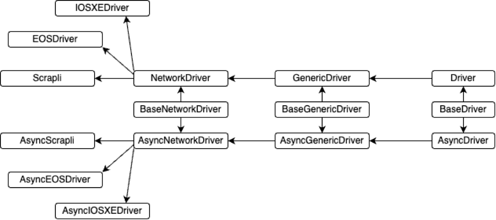

# Scrapli

- [Scrapli](#scrapli)
  - [Описание](#описание)
  - [Семейство Scrapli](#семейство-scrapli)
  - [Уровни абстракции](#уровни-абстракции)
  - [Платформы](#платформы)
  - [Транспорт](#транспорт)
    - [Синхронный транспорт](#синхронный-транспорт)
    - [Асинхронный транспорт](#асинхронный-транспорт)
  - [Установка](#установка)
    - [Ядро](#ядро)
    - [Платформы](#платформы-1)
    - [Transport](#transport)
    - [Парсеры](#парсеры)
  - [Использование](#использование)
    - [`open`](#open)
    - [`close`](#close)
    - [`send_command`](#send_command)
    - [Контекстный менеджер](#контекстный-менеджер)
    - [Transport](#transport-1)
    - [Platforms](#platforms)
    - [Privilege escalation](#privilege-escalation)
    - [`send_command` (detailed)](#send_command-detailed)
    - [`send_commands`](#send_commands)
    - [`send_config`](#send_config)
    - [`send_configs`](#send_configs)
    - [`send_commands_from_file` / `send_configs_from_file`](#send_commands_from_file--send_configs_from_file)
    - [`send_interactive`](#send_interactive)
    - [`send_and_read`](#send_and_read)
    - [`get_prompt`](#get_prompt)
    - [`isalive`](#isalive)
    - [`onopen` / `onclose`](#onopen--onclose)
    - [`Response` / `MultiResponse`](#response--multiresponse)
    - [Таймера](#таймера)
    - [Настройка транспорта](#настройка-транспорта)
    - [Candidate config](#candidate-config)
  - [Отладка](#отладка)
    - [`enable_basic_logging`](#enable_basic_logging)
    - [`channel_log`](#channel_log)
    - [logger `scrapli`](#logger-scrapli)
  - [`GenericDriver`](#genericdriver)
  - [`Driver`](#driver)
  - [Jump-server](#jump-server)

## Описание

[Scrapli](https://github.com/carlmontanari/scrapli) - фреймворк для работы с сетевым оборудованием. Аналог [netmiko](https://github.com/ktbyers/netmiko). Обе этих библиотеки предоставляют абстракцию над механизмами и особенностями подключения к сетевому оборудованию, предоставляя разработчику высокоуровневые методы взаимодействия с устройствами (собрать вывод, отправить конфигурацию, сохранить и прочее).

Несмотря на одинаковое назначение, архитектурно это разные библиотеки. Для Scrapli применимы следующие характеристики:

- Поддержка различных протоколов подключения (`transport` в терминах библиотеки): ssh/telnet (протокол подключения не связан с платформой, как в netmiko)
- Поддержка синхронного и асинхронного режимов работы (есть проект [netdev](https://github.com/selfuryon/netdev) основанный на netmiko, но с поддержкой async, но проект архивный)
- В ядре реализована поддержка небольшого числа платформ, поддержка остальных вынесена в отдельную библиотеку [scrapli_community](https://github.com/scrapli/scrapli_community), которая развивается сообществом.

## Семейство Scrapli

Scrapli это целое семейство библиотек:

- scrapli — библиотека для подключения к устройствам
- scrapli-community — библиотека с поддерживаемыми платформами
- scrapli-replay — библиотека для тестирования, позволяет создать mock SSH сервер и выступить в роли сетевого устройства
- scrapligo/scraplirs — scrapli для Golang/Rust
- scrapli-cfg — управление конфигурацией устройств
- scrapli-netconf — реализация подключения по NETCONF
- nornir-scrapli — плагин для Nornir

## Уровни абстракции

В структуре библиотеки можно выделить три основных уровня абстракции:

- transport — способ подключения к оборудованию
- channel — следующий уровень над transport, отвечает за отправку команд и чтение ответа от устройства
- driver — верхний уровень абстракции, интерфейс пользователя для взаимодействия с оборудованием

Низкоуровневые структуры практически не используются, и для пользователя интерес представляет driver и то, что дальше от него наследуется:
<p align="center"></p>

- `Driver` - может подключаться к оборудованию, предоставляет доступ к channel (есть методы для чтения/записи), реализует контекстный менеджер
- `GenericDriver` - наследуется от `Driver` и дополняет функционал методами отправки команды/конфигурации
- `NetworkDriver` - наследуется от `GenericDriver` и дополняет функционал методами повышения привилегий, подготовкой конфигурации (split), работа с текстовыми парсерами и пр.
- `EOSDriver`, `IOSXEDriver`, `JunosDriver` - непосредственная реализация сетевых платформ, с описанием какие команды нужно ввести что бы перейти в конфигурационный режим, как отключить пагинацию и прочее, описывает правила работы с платформой
- `Scrapli` - фабрика, передав в которую название платформы, можно получить класс-реализацию этой платформы

## Платформы

Ядро (scrapli) поддерживает следующие платформы:

| HW Platform | Scrapli Driver | Scrapli Async Driver | Platform Name |
| - | - | - | - |
| Cisco IOS-XE | IOSXEDriver | AsyncIOSXEDriver | cisco_iosxe |
| Cisco NS-OS | NXOSDriver | AsyncNXOSDriver | cisco_nxos |
| Cisco IOS-XR | IOSXRDriver | AsyncIOSXRDriver | cisco_iosxr |
| Arista EOS | EOSDriver | AsyncEOSDriver | arista_eos |
| Juniper JunOS | JunosDriver | AsyncJunosDriver | juniper_junos |

Поддержка остальных реализуется через отдельную библиотеку [scrapli_community](https://github.com/scrapli/scrapli_community)

## Транспорт

Scrapli поддерживает несколько вариантов организации транспорта для подключения к устройствам:

### Синхронный транспорт

| Transport | Описание |
| - | - |
| `system` | Встроенный ssh клиент (/bin/ssh), используется по умолчанию |
| `ssh2` | Используется библиотека libssh2 |
| `telnet` | Собственная реализация telnet протокола |
| `paramiko` | Используется paramiko |

### Асинхронный транспорт

| Transport | Описание |
| - | - |
| `asyncssh` | Используется библиотека AsyncSSH |
| `asynctelnet` | Собственная реализация telnet протокола |

## Установка

### Ядро

`pip install scrapli` — устанавливается только ядро без дополнительных зависимостей. Минимальный функционал, доступны только встроенные платформы и system/telnet транспорт.

### Платформы

`pip install 'scrapli[community]'` — ядро + scrapli-community. Или отдельно `pip install scrapli-community`, если ядро уже установлено.

### Transport

`pip install 'scrapli[paramiko]'` — ядро + paramiko  
`pip install 'scrapli[ssh2]'` — ядро + ssh2  
`pip install 'scrapli[asyncssh]'` — ядро + asyncssh

### Парсеры

`pip install 'scrapli[genie]'` - поддержка парсера genie  
`pip install 'scrapli[textfsm]'` - поддержка парсера textfsm  
`pip install 'scrapli[ttp]'` - поддержка парсера ttp

## Использование

Параметры для подключения удобно описать в отдельном словаре, и, применив распаковку, передать эти параметры в фабрику Scrapli. По значению, заданному ключом "platform", фабрикой будет выбран соответствующий платформенный драйвер.

```python
from scrapli import Scrapli

device = {
    "platform": "cisco_iosxe",
    "host": "192.168.122.101",
    "auth_username": "admin",
    "auth_password": "P@ssw0rd",
    "auth_strict_key": False,
    "ssh_config_file": True,
}

ssh = Scrapli(**device)
ssh.open()
ssh.close()
```

### `open`

Создание экземпляра класса не инициируют подключение к оборудованию. Для подключения используется отдельный метод `open`.

### `close`

Метод закрывает подключение к оборудованию, освобождая системные ресурсы.

### `send_command`

Метод для сбора вывода одной команды. Возвращается объект класса `Response`, содержащий помимо самого вывода, дополнительную информацию (время выполнения, успешность выполнения и прочее), подробнее ниже.

```python
from scrapli import Scrapli
from scrapli.response import Response

device = {
    "platform": "cisco_iosxe",
    "host": "192.168.122.101",
    "auth_username": "admin",
    "auth_password": "P@ssw0rd",
    "auth_strict_key": False,
}

ssh = Scrapli(**device)
ssh.open()
output: Response = ssh.send_command("show clock")
ssh.close()

print(output.result)
```

### Контекстный менеджер

При использовании контекстного менеджера методы `open` и `close` вызываются автоматически при входе/выходе из контекстного менеджера. Как и в остальных многих случаях, работа через контекстный менеджер является рекомендованной.

```python
from scrapli import Scrapli

device = {
    "platform": "cisco_iosxe",
    "host": "192.168.122.101",
    "auth_username": "admin",
    "auth_password": "P@ssw0rd",
    "auth_strict_key": False,
}

if __name__ == "__main__":
    with Scrapli(**device) as ssh:
        output = ssh.send_command("show clock")

    print(output.result)
```

### Transport

Используемый для подключения к устройству транспорт не зависит от платформы и может быть изменен на лету во время выполнения скрипта.

```python
from itertools import product
from typing import Any

from scrapli import Scrapli
from scrapli.response import Response

hosts = [
    "192.168.122.101",
]

transports = [
    "system",
    "paramiko",
    "telnet",
]

scrapli_template = {
    "platform": "cisco_iosxe",
    "auth_username": "admin",
    "auth_password": "P@ssw0rd",
    "auth_strict_key": False,
}

def send_command(device: dict[str, Any], command: str) -> Response:
    with Scrapli(**device) as ssh:
        return ssh.send_command(command)

if __name__ == "__main__":
    for transport, host in product(transports, hosts):
        print("\n<<<" + "=" * 100 + ">>>")
        print(f"{host=}, {transport=}")
        try:
            result = send_command(
                device=scrapli_template | {"host": host, "transport": transport},
                command="show ip arp",
            )
        except Exception as exc:
            print(f"ошибка {exc.__class__.__name__}: {str(exc)}")
        else:
            print(result.result)
```

### Platforms

Пример подключения к различным платформам.

```python
from dataclasses import asdict, dataclass
from typing import Any

from scrapli import Scrapli
from scrapli.response import Response

@dataclass(slots=True)
class Device:
    host: str
    platform: str
    transport: str = "system"

    def __hash__(self) -> int:
        return hash(self.host + self.platform)

scrapli_template = {
    "auth_username": "admin",
    "auth_password": "P@ssw0rd",
    "auth_secondary": "P@ssw0rd",
    "auth_strict_key": False,
    "ssh_config_file": True,
}

devices = {
    Device(host="192.168.122.101", platform="cisco_iosxe"): "show ip arp",
    Device(host="192.168.122.102", platform="cisco_iosxe", transport="telnet"): "show ip arp",
    Device(host="192.168.122.103", platform="huawei_vrp"): "display arp",
    Device(host="192.168.122.104", platform="arista_eos"): "show ip arp",
}

def send_command(device: dict[str, Any], command: str) -> Response:
    with Scrapli(**device) as ssh:
        return ssh.send_command(command)

if __name__ == "__main__":
    for device, command in devices.items():
        print("\n<<<" + "=" * 100 + ">>>")
        print(f"{device.host=}, {command}")
        try:
            result = send_command(
                device=scrapli_template | asdict(device),
                command=command,
            )
        except Exception as exc:
            print(f"ошибка {exc.__class__.__name__}: {str(exc)}")
        else:
            print(result.result)
```

### Privilege escalation

Scrapli предоставляет один метод `acquire_priv` который принимает в качестве аргумента имя требуемого уровня. Имена доступных уровней описаны в определении платформы. Например:

- [cisco_iosxe](https://github.com/carlmontanari/scrapli/blob/main/scrapli/driver/core/cisco_iosxe/base_driver.py):
  - exec,
  - privilege_exec,
  - configuration,
  - tclsh
- [arista_eos](https://github.com/carlmontanari/scrapli/blob/main/scrapli/driver/core/arista_eos/base_driver.py):
  - exec,
  - privilege_exec,
  - configuration,
- [huawei_vrp](https://github.com/scrapli/scrapli_community/blob/main/scrapli_community/huawei/vrp/huawei_vrp.py):
  - privilege_exec,
  - configuration
- [eltex_esr](https://github.com/scrapli/scrapli_community/blob/main/scrapli_community/eltex/esr/eltex_esr.py):
  - exec,
  - privilege_exec,
  - configuration

При этом существует уровень по-умолчанию, который Scrapli пытается получить при подключении к устройству. Имя этого уровня задается при определении платформы и может быть переопределено при создании объекта Scrapli. Для повышения привилегий используется пароль из значения `auth_secondary` атрибута.

Например ситуация (cisco): пользователь имеет ограниченные права и не может попасть в привилегированный exec режим (#), но этот режим прописан в качестве значения по умолчанию для платформ cisco (например cisco_iosxe). Поэтому при попытке подключиться и собрать какие-либо выводы с устройства будет неуспешной, так как Scrapli после подключения определит текущий режим как exec (>), сделает попытку перейти в privilege_exec (#), которая закончится ошибкой (нет enable пароля и у пользователя нет прав на #). В этой ситуации доступны два варианта решения:

- повысить уровень привилегий пользователю и задать enable пароль через атрибут auth_secondary. В этом случае попытка повысить уровень будет успешной
- при создании объекта Scrapli указать, что желаемый уровень не privilege_exec, а exec. В этом случае Scrapli не будет пытаться повысить уровень (останется в >).

```python
from typing import Any

from scrapli import Scrapli
from scrapli.response import Response

device = {
    "platform": "cisco_iosxe",
    "host": "192.168.122.101",
    "auth_username": "user",
    "auth_password": "P@ssw0rd",
    "auth_strict_key": False,
    "ssh_config_file": True,
    "default_desired_privilege_level": "exec",
}


def send_command(device: dict[str, Any], command: str) -> Response:
    with Scrapli(**device) as ssh:
        output = ssh.send_command(command)
    return output

if __name__ == "__main__":
    try:
        result = send_command(device, "show privilege")
    except Exception as exc:
        print(f"ошибка {exc.__class__.__name__}: {str(exc)}")
    else:
        print(result.result)
```

### `send_command` (detailed)

Метод `send_command` отправляет одну команду и возвращает результат её выполнения в виде объекта `Response`. В качестве дополнительных параметров в метод можно передать

- `strip_prompt` отрезать или нет prompt устройства из вывода. По умолчанию отрезается.
- `failed_when_contains` паттерн, встретив который, библиотека понимает, что вывод собрать не удается. По умолчанию берется из описания платформы, но есть возможность переопределить для конкретного вывода.
- `timeout_ops` таймаут операции, если вывод занимает много времени. По умолчанию берется таймаут, заданный при создании объекта Scrapli, но есть возможность переопределить его для конкретного вывода (30 секунд).

```python
from typing import Any

from scrapli import Scrapli
from scrapli.response import Response

device = {
    "platform": "cisco_iosxe",
    "host": "192.168.122.101",
    "auth_username": "admin",
    "auth_password": "P@ssw0rd",
    "auth_strict_key": False,
    "ssh_config_file": True,
}

def send_command(device: dict[str, Any], command: str) -> Response:
    with Scrapli(**device) as ssh:
        return ssh.send_command(
            command=command,
            strip_prompt=False,
            failed_when_contains="%",
            timeout_ops=5,
        )

if __name__ == "__main__":
    try:
        result = send_command(device, "show version")
    except Exception as exc:
        print(f"ошибка {exc.__class__.__name__}: {str(exc)}")
    else:
        print(result.result)
```

### `send_commands`

Метод `send_commands` делает то же самое, что и `send_command`, только для списка команд. Дополнительно в качестве аргумента в метод можно передать

- `stop_on_failed` если будет ошибка сбора (сработает failed_when_contains), то останавливать сбор команд или нет. По умолчанию собираются все команды, не зависимо от того, были ли ошибки во время сбора или нет.

Так же, в отличии от `send_command`, метод возвращает объект класса `MultiResponse`, а не `Response`. По сути это просто список объектов `Response` по каждой команде, переданной для сбора.

```python
from typing import Any

from scrapli import Scrapli
from scrapli.response import MultiResponse

device = {
    "platform": "cisco_iosxe",
    "host": "192.168.122.101",
    "auth_username": "admin",
    "auth_password": "P@ssw0rd",
    "auth_strict_key": False,
    "ssh_config_file": True,
}

def send_commands(device: dict[str, Any], commands: list[str]) -> MultiResponse:
    with Scrapli(**device) as ssh:
        return ssh.send_commands(
            commands=commands,
            stop_on_failed=True,
        )

if __name__ == "__main__":
    try:
        result = send_commands(
            device,
            [
                "show ip arp",
                "shw ip int br",
                "show version",
            ],
        )
    except Exception as exc:
        print(f"ошибка {exc.__class__.__name__}: {str(exc)}")
    else:
        print(result.result)
```

### `send_config`

Метод отправляет строку конфигурации. Строка может быть как одной командой, так и несколькими командами, разделенными переносами строки. Помимо конфигурации передать в метод можно те же параметры, что и в метод `send_commands`.

```python
from textwrap import dedent
from typing import Any

from scrapli import Scrapli
from scrapli.response import Response

device_scrapli = {
    "platform": "cisco_iosxe",
    "host": "192.168.122.101",
    "auth_username": "admin",
    "auth_password": "P@ssw0rd",
    "auth_strict_key": False,
    "ssh_config_file": True,
}

def send_config(device: dict[str, Any], config: str) -> Response:
    with Scrapli(**device) as ssh:
        return ssh.send_config(config=config)

if __name__ == "__main__":
    config = "no ip domain lookup"
    try:
        result = send_config(device_scrapli, config)
    except Exception as exc:
        print(f"ошибка {exc.__class__.__name__}: {str(exc)}")
    else:
        print(result.result)
```

### `send_configs`

Аналогично паре `send_command` - `send_commands`, метод `send_configs` отправляет список конфигурационных команд и является парой для `send_config`. Дополнительные параметры те же самые, но `stop_on_failed` в этом случае уже имеет важное значение, если для `send_config` актуальность он не имел (отправляется одна конфигурационная строчка), то в случае списка конфигурации и `send_configs`, этот атрибут позволит остановить применение команд и показать, где произошла ошибка.

```python
from textwrap import dedent
from typing import Any

from scrapli import Scrapli
from scrapli.response import MultiResponse

device = {
    "platform": "cisco_iosxe",
    "host": "192.168.122.101",
    "auth_username": "admin",
    "auth_password": "P@ssw0rd",
    "auth_strict_key": False,
    "ssh_config_file": True,
}


def send_configs(device: dict[str, Any], configs: list[str]) -> MultiResponse:
    with Scrapli(**device) as ssh:
        return ssh.send_configs(
            configs=configs,
            stop_on_failed=True,
        )


if __name__ == "__main__":
    config = (
        dedent(
            """
            int loo1001
             ip address 100.64.72.101 255.255.255.255
            int loo1002
             ip address 100.64.73.101 255.255.255.255
            """,
        )
        .strip()
        .splitlines()
    )
    try:
        result = send_configs(device, config)
    except Exception as exc:
        print(f"ошибка {exc.__class__.__name__}: {str(exc)}")
    else:
        print(result.result)
```

### `send_commands_from_file` / `send_configs_from_file`

Методы аналогичны `send_commands` / `send_configs`, только в качестве входного параметра принимают не список команд, а имя файла, из которого нужно прочитать команды. В остальном изменений нет.

### `send_interactive`

Метод `send_interactive` позволяет обрабатывать интерактивное взаимодействие с устройством. В качестве событий передается список кортежей, каждый кортеж состоит из отсылаемой команды, ожидаемой строки (строка, а не regex) и опционального флага для скрытия вывода в логах (например при вводе пароля). Для примера ниже: `("ping", "[ip]:", False),`: `"ping"` - вводимая команда, `"[ip]:"` - ожидаемый ответ с устройства, `False` - скрывать ввод в логах или нет (по умолчанию False, поэтому этот элемент можно вообще опустить).

В качестве дополнительных параметров в метод можно передать:

- `privilege_level` - уровень, на котором выполнять команды
- `timeout_ops` - таймаут операции, тут таймаут для каждой команды, а не суммарный на всю интерактивную сессию
- `failed_when_contains` - паттерн для определения ошибки, аналогичен предыдущим методам

```python
from typing import Any

from scrapli import Scrapli
from scrapli.response import Response

device = {
    "platform": "cisco_iosxe",
    "host": "192.168.122.101",
    "auth_username": "admin",
    "auth_password": "P@ssw0rd",
    "auth_secondary": "P@ssw0rd",
    "auth_strict_key": False,
    "ssh_config_file": True,
}

def ping_interactive(device: dict[str, Any], target: str) -> Response:
    with Scrapli(**device) as ssh:
        prompt = ssh.get_prompt()
        return ssh.send_interactive(
            interact_events=[
                ("ping", "[ip]:", False),
                ("ip", "Target IP address:", False),
                (target, "Repeat count [5]:", False),
                ("10", "Datagram size [100]:", False),
                ("1500", "Timeout in seconds [2]:", False),
                ("1", "Extended commands [n]:", False),
                ("n", "Sweep range of sizes [n]:", False),
                ("n", prompt, False),
            ],
        )

if __name__ == "__main__":
    try:
        result = ping_interactive(device, "10.255.255.102")
    except Exception as exc:
        print(f"ошибка {exc.__class__.__name__}: {str(exc)}")
    else:
        print(result.result)
```

### `send_and_read`

Метод позволяет определить набор ожидаемых ответов от устройства и принимать их как индикатор успешности выполнения команды. Метод полезен для автоматического подтверждения запросов со стороны устройства.

```python
def send_command(device: dict[str, Any], command: str) -> MultiResponse:
    with Scrapli(**device) as ssh:
        result = MultiResponse()
        output: Response = ssh.send_and_read(
            channel_input=command,
            expected_outputs=[
                ssh.comms_prompt_pattern,
                "[confirm]",
                "[yes/no]",
            ],
            timeout_ops=5,
        )
        result.append(output)
        if "[confirm]" in output.result:
            result.append(ssh.send_command("\n"))
        elif "[yes/no]" in output.result:
            result.append(ssh.send_command("yes"))
        return result
```

### `get_prompt`

Метод позволяет получить текущий prompt устройства

```python
with Scrapli(**device) as ssh:
    prompt = ssh.get_prompt()
```

### `isalive`

Метод позволяет проверить, активно ли подключение к устройству в данный момент или нет.

```python
from typing import Any

from scrapli import Scrapli

device = {
    "platform": "cisco_iosxe",
    "host": "192.168.122.101",
    "auth_username": "admin",
    "auth_password": "P@ssw0rd",
    "auth_secondary": "P@ssw0rd",
    "auth_strict_key": False,
    "ssh_config_file": True,
}

def check_alive(device: dict[str, Any]) -> None:
    with Scrapli(**device) as ssh:
        print(ssh.get_prompt())
        print(f"после подключения: {ssh.isalive()=}")

        ssh.close()
        try:
            _ = ssh.get_prompt()
        except Exception:
            print(f"ошибка после выхода {ssh.isalive()=}")
            ssh.open()
            print(f"после повторного подключения:  {ssh.isalive()=}")

        print(ssh.get_prompt())

if __name__ == "__main__":
    try:
        check_alive(device)
    except Exception as exc:
        print(f"ошибка {exc.__class__.__name__}: {str(exc)}")

```

### `onopen` / `onclose`

При создании объекта Scrapli можно указать атрибуты `onopen` / `onclose`. В качестве значений в этих атрибутах передаются ссылки на функции, которые будет вызваны после открытия сессии с устройством (после работы метода `open`), и перед закрытием сессии (перед выполнением метода `close`). Тем самым можно добавить какие-либо команды, например сохранять конфигурацию на устройстве при выходе или включать отображение timestamp при входе. Параметр `onopen` переопределяет значение по умолчанию для каждой платформы, например отключающий пагинацию, поэтому этот функционал нужно так же учесть.

```python
from typing import Any

from scrapli import Scrapli
from scrapli.response import Response

device = {
    "platform": "cisco_iosxe",
    "host": "192.168.122.101",
    "auth_username": "admin",
    "auth_password": "P@ssw0rd",
    "auth_strict_key": False,
    "ssh_config_file": True,
}


def write_memory(ssh: Scrapli) -> None:
    ssh.send_command("write memory")


def enable_timestamp(ssh: Scrapli) -> None:
    ssh.send_command("terminal exec prompt timestamp")
    ssh.send_command("terminal length 0")


def send_command(device: dict[str, Any], command: str) -> Response:
    with Scrapli(
        **device,
        on_open=enable_timestamp,
        on_close=write_memory,
    ) as ssh:
        output = ssh.send_command(command)
        return output


if __name__ == "__main__":
    try:
        result = send_command(device, "show ip arp")
    except Exception as exc:
        print(f"ошибка {exc.__class__.__name__}: {str(exc)}")
    else:
        print(result.result)
```

### `Response` / `MultiResponse`

Объекты `Response` / `MultiResponse` используются как возвращаемые значения при выполнении команд. В отличии от netmiko, в которой возвращается строка, объекты `Response` / `MultiResponse` имеют дополнительные методы и атрибуты, которые могут быть полезны при работе.

Некоторые атрибуты и метода объекта `Response`:

- `.result` — непосредственно вывод с оборудования
- `.raw_result` — сырой вывод с оборудования, как правило это байтовая строка
- `.failed` — выполнена ли команда с ошибкой или нет (`True` - ошибка выполнения)
- `.start_time` / `.finish_time` / `.elapsed_time` — тайминги по выполнению команды
- `.channel_input` - что было отправлено на устройство (отсылаемая команда)
- `.host` - устройство, на котором была выполнена команда
- `.failed_when_contains` - список паттернов, по которым проводилась проверка на успешность выполнения команды
- `.textfsm_parse_output()` / `genie_parse_output()` / `ttp_parse_output()` — парсинг выводов использую соответствующий текстовый парсер
- `.raise_for_status()` - метод возбуждает исключение, если команды была исполнена с ошибкой, аналогичен методу `raise_for_status` в библиотеке `requests`

`MultiResponse` это список объектов `Response`. Имеет атрибуты `result`, `host`, `failed`, которые являются агрегирующими результатами соответствующих атрибутов всех `Response` объектов (т.е. если все `Response` объекты имеют `failed` = `False`, то и `MultiResponse` будет иметь `failed` = `False`, а если у хотя бы одного `Response` объекты `failed` = `True`, то и весь `MultiResponse` будет иметь `failed` = `True`).

```python
from typing import Any

from scrapli import Scrapli
from scrapli.response import MultiResponse

device = {
    "platform": "cisco_iosxe",
    "host": "192.168.122.101",
    "auth_username": "admin",
    "auth_password": "P@ssw0rd",
    "auth_strict_key": False,
    "ssh_config_file": True,
}


def send_commands(device: dict[str, Any], commands: list[str]) -> MultiResponse:
    with Scrapli(**device) as ssh:
        return ssh.send_commands(
            commands=commands,
            stop_on_failed=True,
        )


if __name__ == "__main__":
    try:
        result = send_commands(
            device,
            [
                "show ip arp",
                "show ip interface br",
            ],
        )
    except Exception as exc:
        print(f"ошибка {exc.__class__.__name__}: {str(exc)}")
    else:
        for r in result:
            print("-" * 100)
            print(f"command: {r.channel_input}")
            print(f"status: {not r.failed}")
            print(f"elapsed time: {r.elapsed_time:.4f} сек")
            print(f"output:\n{r.result}")
```

### Таймера

При создании Scrapli объекта существует возможность указать три таймера

- `timeout_socket` (15 по умолчанию) - таймаут на установления соединения с устройством (открытие сокета)
- `timeout_transport` (30 по умолчанию) - таймаут на установление telnet/ssh сессии с устройством
- `timeout_ops` (30 по умолчанию) - таймаут на одну операцию

Первые два (`timeout_socket` и `timeout_transport`) играют роль при подключении к устройству, если медленные каналы или устройство медленно отвечает, то нужно увеличивать их (конкретные значения зависят от ситуации). `timeout_ops` определяет таймаут на сбор/выполнения команды и может быть переписан непосредственно в методах типа `send_commands`/`send_configs`/... если ожидается большой и долгий вывод с оборудования, например при сохранении/сбора конфигурации со стека.

### Настройка транспорта

Настройка транспорта актуальна прежде всего для SSH, где нужно прописывать те или иные опции (например метод обмена ключами). Сделать настройки можно двумя путями:

- прописать аргумент `transport_options` при создании объекта Scrapli и в нем обозначить нужные опции

    ```python
    device = {
        "platform": "cisco_iosxe",
        "host": "192.168.122.101",
        "auth_username": "admin",
        "auth_password": "P@ssw0rd",
        "auth_strict_key": False,
        "transport_options": {
            "open_cmd": [
                "-o",
                "KexAlgorithms=+diffie-hellman-group-exchange-sha1",
                "-o",
                "HostKeyAlgorithms=+ssh-rsa",
            ]
        },
    }

    with Scrapli(**device) as ssh:
        pass
    ```

- собрать нужные опции в ssh config файл и указать его через аргумент `ssh_config_file`

    ```text
    Host *
        PubkeyAuthentication no
        KexAlgorithms +diffie-hellman-group1-sha1,diffie-hellman-group-exchange-sha1,diffie-hellman-group14-sha1
        Ciphers +aes128-cbc,3des-cbc,aes192-cbc,aes256-cbc
    ```

    ```python
    device_scrapli = {
        ...
        "ssh_config_file": "./ssh_scrapli",
        ...
    }
    with Scrapli(**device) as ssh:
        pass
    ```

    или использовать системный ssh config файл

    ```python
    device = {
        ...
        "ssh_config_file": True,
        ...
    }
    with Scrapli(**device) as ssh:
        pass
    ```

### Candidate config

Некоторый платформы поддерживают работу с candidate-config. Например, Arista EOS:

```text
arista#configure terminal
arista(config)#exit

arista#configure session
arista(config-s-s1)#abort
```

`configure terminal` - классический режим, при котором вводимые команды сразу имеют эффект
`configure session` - режим настройки candidate config, при котором введенные команды применяются только после commit'а.

Для работы с candidate config используется метод `register_configuration_session` который позволяет динамически создавать privilege level, который можно использовать при отправки конфигурации.

```python
from typing import Any

from scrapli.driver.core import EOSDriver
from scrapli.response import MultiResponse

device = {
    "host": "192.168.122.104",
    "auth_username": "admin",
    "auth_password": "P@ssw0rd",
    "auth_secondary": "P@ssw0rd",
    "auth_strict_key": False,
    "ssh_config_file": True,
}


def send_configs(device: dict[str, Any], configs: list[str], dry_run: bool = True) -> MultiResponse:
    with EOSDriver(**device) as ssh:
        privilege_level = "candidate"
        ssh.register_configuration_session(session_name=privilege_level)
        output = ssh.send_configs(
            configs=configs,
            stop_on_failed=True,
            privilege_level=privilege_level,
        )
        if dry_run:
            output.extend(
                ssh.send_configs(
                    configs=["show session-config diffs", "", "abort"],
                    privilege_level=privilege_level,
                ),
            )
        else:
            output.append(
                ssh.send_config(
                    config="commit",
                    privilege_level=privilege_level,
                ),
            )
            output.append(
                ssh.send_command(
                    command=f"no configure session {privilege_level}",
                ),
            )
        return output


if __name__ == "__main__":
    config = [
        "int loo1001",
        "description test",
        "ip address 100.64.72.201 255.255.255.255",
    ]
    try:
        result = send_configs(device, config, True)
    except Exception as exc:
        print(f"ошибка {exc.__class__.__name__}: {str(exc)}")
    else:
        print(result.result)
```

## Отладка

В Scrapli существует три способа получить отладочную информацию:

- функция `enable_basic_logging`
- атрибут `channel_log` при создании объекта Scrapli (записывается буфер сессии, а не отладочная информация по подключению/сбору)
- настройка logger'а `scrapli` напрямую

### `enable_basic_logging`

Функция проста в использовании и позволяет быстро настроить запить лога в файл

```python
from scrapli.logging import enable_basic_logging

enable_basic_logging("./debug.log", "DEBUG")
```

### `channel_log`

Атрибут `channel_log` позволяет задать файл, в который будет записываться буфер сессии (либо указать `True`, тогда будет запись в файл со стандартным именем `scrapli_channel.log`)

```python
with Scrapli(
    **device,
    # channel_log=True,
    # channel_log_mode="append",
    channel_log="./debug.log",
) as ssh:
    pass
```

### logger `scrapli`

Если требуется более сложная настройка, тогда можно использовать logger с именем `scrapli`, получив который, можно настроить его нужным образом.

```python
import logging

logger = logging.getLogger("scrapli")
logger.setLevel(logging.DEBUG)

sh = logging.StreamHandler()
logger.addHandler(sh)
```

## `GenericDriver`

Когда платформа не описана, то для нее нет готового класса и можно спуститься на один уровень абстракции ниже - до `GenericDriver`, и использовать этот класс для подключения к оборудованию. Он предоставляет все те же самые методы (send_config/send_commands), но обработка режимов привилегий, приглашений, отключение пагинации и прочее ложится на разработчика.

```python
from scrapli.driver import GenericDriver

device = {
    "host": "192.168.122.101",
    "auth_username": "admin",
    "auth_password": "P@ssw0rd",
    "auth_strict_key": False,
    "ssh_config_file": True,
}

with GenericDriver(**device) as ssh:
    ssh.send_command("terminal length 0")
    ssh.send_command("terminal width 512")    
    output = ssh.send_command("show version")
    prompt = ssh.get_prompt()

print(prompt)
print(output.result)
```

## `Driver`

Еще более низкий уровень может потребоваться, когда с оборудованием не получается работать на уровне `GenericDriver`. В этом случае можно опуститься до уровня `Driver`, но на нем уже нет привычных методов и отправку/получение данных нужно производить обращаясь к методам channel напрямую, или методам transport (на уровень еще ниже). Перечисленные методы и объекты (channel/transport) доступны и на более высоких уровнях абстракции, но зачастую обращение к ним не имеет смысл, так как есть более высокоуровневые методы.

```python
import time

from scrapli import Driver

device = {
    "host": "192.168.122.101",
    "auth_username": "admin",
    "auth_password": "P@ssw0rd",
    "auth_strict_key": False,
    "ssh_config_file": True,
}

with Driver(**device) as ssh:
    _, output_ch = ssh.channel.send_input("show clock")
    prompt = ssh.channel.get_prompt()

    ssh.transport.write(b"show clock\n")
    time.sleep(1)
    output_tr = ssh.transport.read()

print(prompt)
print("-" * 10)
print(output_ch.decode())
print("-" * 10)
print(output_tr.decode())
```

## Jump-server

Доступно несколько вариантов подключения к устройствам через jump-server, возможности и настройка зависят от используемого транспорта. Самый простой вариант - использовать ssh-config файл.

```text
Host jumphost
  PubkeyAuthentication yes
  Hostname jumphost.my.com
  User jumpuser
  IdentityFile /path/to/key


Host *
  PubkeyAuthentication no
  KexAlgorithms +diffie-hellman-group-exchange-sha1,diffie-hellman-group14-sha1,diffie-hellman-group1-sha1
  HostKeyAlgorithms +ssh-rsa
  ProxyJump jumphost
```

И использовать его в коде:

```python
device = {
    "auth_username": "username",
    "auth_password": "password",
    "auth_strict_key": False,
    "ssh_config_file": "/path/to/custom/ssh/config",
}
```

Либо настройки из ssh-config файла перенести в transport_options:

```python
device = {
    "ssh_config_file": False,
    "transport": "system",
    "transport_options": {
        "open_cmd": [
            "-o",
            "ProxyCommand=ssh -W %h:%p -i /path/to/custom/ssh/config jumpuser@jumphost.my.com",
        ],
    },
}
```

Данный метод работает на system транспорте, так как использует возможности встроенного SSH агента.

Если требуется использовать другой транспорт, например paramiko/telnet/..., то подключение через jump-server можно сделать через commandeer.
