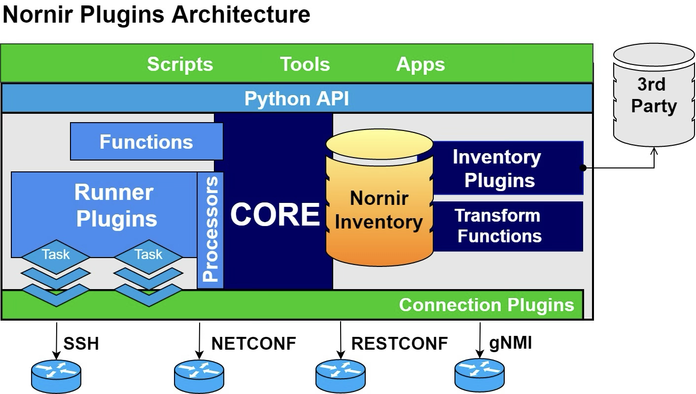

# Nornir

- [Nornir](#nornir)
  - [Описание](#описание)
  - [Сравнение с Ansible](#сравнение-с-ansible)
  - [Плагины](#плагины)
  - [Установка](#установка)
  - [Базовая структура проекта](#базовая-структура-проекта)
  - [Инициализация Nornir](#инициализация-nornir)
  - [inventory: SimpleInventory](#inventory-simpleinventory)
  - [runner: threaded](#runner-threaded)
  - [Задача (Task)](#задача-task)
  - [Result, MultiResult, AggregatedResult](#result-multiresult-aggregatedresult)
  - [print\_result](#print_result)
  - [severity\_level](#severity_level)
  - [Failed hosts](#failed-hosts)
  - [Собственные плагины](#собственные-плагины)
    - [Processors](#processors)
    - [Functions](#functions)
    - [Inventory](#inventory)
    - [Runner](#runner)
    - [TransformFunction](#transformfunction)
  - [Фильтрация](#фильтрация)

## Описание

[Nornir](https://github.com/nornir-automation/nornir) — фреймворк для управления сетевой инфраструктурой, написанный на Python и для Python. В отличие от более популярных инструментов, таких как Ansible, Nornir — написан полностью на Python и предоставляет интерфейс для создания кастомных сценариев автоматизации. Это дает возможность использовать nornir непосредственно в коде приложения.

Плюсы:

- полный контроль на уровне python-кода. Не нужно использовать промежуточные DSL (например YAML для Ansible), вся логика находится в python-коде.
- параллелизм из коробки. Использует threading или multiprocessing для одновременного подключения к множеству устройств, скрывая от пользователя сложности реализации.
- расширяемость. Nornir поддерживает плагины, можно писать свои инвентаризации, модули подключения, обработчики задач.
- легкая интеграция. Как следствие того, что это python-фреймворк, то он легко интегрируется с другими python-фреймворками (Django/FastAPI и пр).

Минусы:

- высокий порог входа: нужно писать на python
- меньше готовых модулей, по сравнению с Ansible
- меньше сообщество (как следствие сложно получить поддержку/совет в случае проблем, слабее документация и меньше примеров)
- отсутствие декларативности, которую поддерживают некоторые модули Ansible

## Сравнение с Ansible

Наиболее близкий аналог Nornir это Ansible:

| Характеристика | Nornir | Ansible |
| - | - | - |
| Язык | Python | YAML |
| Подход | Императивный | Декларативный (если модуль поддерживает) |
| Параллелизм | Да  (`threading`) | Да (`forks`) |
| Расширяемость | Высокая (на Python) | Высокая, но требует написания модулей |
| Уровень абстракции | Низкий (больше контроля) | Высокий (меньше контроля) |
| Аудитория | DevNet, python-разработчики | Сетевые инженеры, NetOps |
| Порог входа | Средний/высокий | Низкий/средний |

## Плагины

Практически весь функционал nornir реализован через систему плагинов. Необходимый набор поставляется при установки, остальные (в том числе и от сторонних разработчиков), могут быть установлены отдельно.
<p align="center"></p>

- Inventory — возможность сбора входных данных из разных источников
- Transform functions — преобразование входных данных
- Connections — использование различных протоколов/библиотек для подключения к оборудованию
- Processor — реакция на какие-либо события в ходе выполнения кода
- Runners — стратегия выполнения задач

## Установка

- `poetry add nornir` - установка ядра
- `poetry add nornir-utils` - установка базовых утилит (инвентарный файл из yaml, печать результатов, ...)
- `poetry add nornir-scrapli` - подключение к устройствам через scrapli библиотеку

Список плагинов можно посмотреть на [странице](https://nornir.readthedocs.io/en/latest/community/plugin_list.html) проекта.

## Базовая структура проекта

В примерах будет рассматриваться следующая структура проекта:

```text
├── config.yaml          - файл с настройками nornir
├── inventory
│   ├── defaults.yaml    - переменные по умолчанию
│   ├── groups.yaml      - групповые переменные
│   └── hosts.yaml       - хостовые переменные
└── main.py              - основной файл программы
```

## Инициализация Nornir

Для того, что бы инициализировать Nornir необходимо передать в него некоторые параметры. Эти параметры можно определять как в самом python коде, так и в отдельном yaml файле, или комбинацией yaml + python.

Инициализация

```yaml
inventory:
  plugin: SimpleInventory
  options:
    host_file: ./inventory/hosts.yaml
    group_file: ./inventory/groups.yaml
    defaults_file: ./inventory/defaults.yaml
logging:
  enabled: True
runner:
  plugin: threaded
  options:
    num_workers: 20
```

```python
nr = InitNornir(config_file="./config.yaml"))
```

эквивалентна полному заданию конфигурации в python:

```python
nr = InitNornir(
    inventory={
        "plugin": "SimpleInventory",
        "options": {
            "host_file": "./inventory/hosts.yaml",
            "group_file": "./inventory/groups.yaml",
            "defaults_file": "./inventory/defaults.yaml",
        },
    },
    logging={
        "enabled": True,
    },
    runner={
        "plugin": "threaded",
        "options": {
            "num_workers": 30,
        },
    },
)
```

Кроме этого почти все настройки можно передать через переменные окружения. Имена переменных проще смотреть в исходниках либо в [документации](https://nornir.readthedocs.io/en/latest/configuration/index.html).

Приоритет источника конфигураций: env, yaml, python.

## inventory: SimpleInventory

Плагин SimpleInventory относится к системе Inventory, которая отвечает за то, чтобы задать список управляемых устройств (hosts), их группы, параметры подключения и другие данные. SimpleInventory входит в ядро Nornir и не требует отдельной установки. Плагин читает три yaml-файла:

- defaults_file - файл с переменными, которые попадают во все hosts
- group_file - файл групповых переменных, определяет группы устройств и их настройки
- host_file - файл хостовых переменных, определяет настройки конкретных устройств, в том числе список групп, в которые входят устройства

и собирает параметры устройства, собранные в одном python-объекте.

Существуют ключи:

- name - имя объекта, используется внутри nornir
- platform - платформа, нужна для драйвера подключения
- hostname / port - fqdn/ip + порт, используемые для подключения к устройству
- username / password - логин/пароль для подключения
- data - для хранения всех остальных переменных

## runner: threaded

Один из двух runner'ов, поставляемых с ядром Nornir:

- serial (nornir.plugins.runners.SerialRunner)
- threaded (nornir.plugins.runners.ThreadedRunner)

serial - последовательное выполнение задач
threaded - выполнение задач с в потоках, используя ThreadPoolExecutor

## Задача (Task)

Это единица работы, которая выполняется на каждом из хостов из списке inventory. Задачи (Task'и) реализуются как функции, первым аргументом которых передается объект `nornir.core.task.Task`, через который внутри функции можно получить доступ к параметрам выполнения, например хосту, для которого выполнятся задача. Можно провести аналогию с параметром self для методов класса, который является ссылкой на конкретный экземпляр класса и через который внутри метода можно получить доступ ко всем его атрибутам.

Задачи можно писать самостоятельно или использовать уже готовые, написанные сторонними разработчиками.

Для запуска задач есть два основных варианта:

- `nr.run(task=...)` - используется из основного кода для всех устройств из inventory
- `nr.filter(...).run(...)` - из основного кода для выборки устройств
- `task.run(task=...)` - используется для запуска вложенных задач изнутри task-функции

В `nornir_utils` есть тестовые примеры задач, такие как:

- `nornir_utils.plugins.tasks.networking.tcp_ping` - проверка открыт ли порт
- `nornir_utils.plugins.tasks.data.echo_data` - вспомогательная задача, печатающая переданные в неё данные

Некоторые задачи могут поставляться сторонними разработчиками, например пакет `nornir_scrapli` предоставляет одноименные `scrapli` задачи:

- `nornir_scrapli.tasks.core.send_command` - отправка одной команды
- `nornir_scrapli.tasks.core.send_config` - отправка одной конфигурационной команды

Верхнеуровневые задачи разработчик пишет самостоятельно, использую имеющиеся наборы задач.

## Result, MultiResult, AggregatedResult

Результатом работы одной задачи (или подзадачи) на одном устройстве является объект `nornir.core.task.Result`.
Он содержит:

- host - где выполнялась задача
- result - сам результат, в который записывается какая-либо информация
- failed - была ли задача завершена с ошибкой или нет
- changed - вносила ли задача изменения на устройство (это не автоматический флаг, а выставляется автором задачи в зависимости от реализуемой логики)
- ряд других дополнительных полей

Если в рамках одной задачи было запущено несколько подзадач, то их результат группируется в список `list[Result]` который представляет собой объект `nornir.core.task.MultiResult`. Но это все еще действия над одном устройством.

Результатом выполнения `nr.run()` является `nornir.core.task.AggregatedResult`, который представляет собой словарь host -> MultiResult, т.е. агрегирует результаты выполнения для всех хостов.

## print_result

Функция `nornir_utils.plugins.functions.print_result` это базовая функция для печати `AggregatedResult`.

Общий формат вывода:

```text
<название_задачи>************************************************************************
* <хост> ** changed : <True/False> ******************************************************
vvvv <название_вложенной_подзадачи> ** changed : <True/False> vvvvvvvvvvvvvvvvvvvvvvvvvv INFO
<результат>
^^^^ END <вложенная_подзадача> ^^^^^^^^^^^^^^^^^^^^^^^^^^^^^^^^^^^^^^^^^^^^^^^^^^^^^^^^^
```

## severity_level

По умолчанию все задачи имеют приоритет `logging.INFO` (20). Это влияет на отображение результатов через функцию `print_result`, которая так же принимает аргумент `severity_level=logging.INFO`, задающий минимальный уровень для печати. Задавая нужные уровни при запуске задач можно управлять выводом, который формирует `print_result`. Заданный на задачу `severity_level` устанавливается как на саму задачу, так и на все подзадачи.

## Failed hosts

Если задача/подзадача завершилась неудачно, то устройство исключается из дальнейшей обработки.

Что бы маскировать возможные ошибки, запуск задачи (task.run) необходимо оборачивать в try/except и отлавливать исключение `nornir.core.exceptions.NornirSubTaskError`.

Множество неуспешных устройств (имена) доступно в объекте `nr.data.failed_hosts`, который можно очистить `nr.data.reset_failed_hosts()` или `nr.data.recover_host(host)` для указанного устройства . Кроме этого, в объекте AggregatedResult (возвращается `nr.run()`) неуспешные устройства и результат задач находится в словаре `result.failed_hosts: dict[str, MultiResult]`

Повторить запуск задач только для неуспешных устройств можно конструкцией

```python
if nr.data.failed_hosts:
    retry_result = nr.run(task=task_name, on_good=False, on_failed=True)
```

## Собственные плагины

### Processors

Это механизмы для обработки выполнения задач в реальном времени: до, после или во время исполнения задач. По смыслу похожи на middleware/хуки, которые позволяют вмешиваться в ход выполнения задач и получать дополнительный контроль.

Как и остальные плагины, процессор может быть написан самостоятельно, либо реализован сторонними разработчиками. Процессор должен реализовать протокол `nornir.core.processor.Processor`, который определяет следующие методы вызываемые в определенные моменты жизни программы.

```python
class MyProcessor:
    def task_started(self, task: Task) -> None:
        """This method is called right before starting the task."""

    def task_completed(self, task: Task, result: AggregatedResult) -> None:
        """This method is called when all the hosts have completed executing their respective task."""

    def task_instance_started(self, task: Task, host: Host) -> None:
        """This method is called before a host starts executing its instance of the task."""

    def task_instance_completed(self, task: Task, host: Host, result: MultiResult) -> None:
        """This method is called when a host completes its instance of a task."""

    def subtask_instance_started(self, task: Task, host: Host) -> None:
        """This method is called before a host starts executing a subtask."""

    def subtask_instance_completed(self, task: Task, host: Host, result: MultiResult) -> None:
        """This method is called when a host completes executing a subtask."""
```

Плагины типа Processor не требуют регистрации и используются через `with_processors` в виде:

```python
result = nr.with_processors(
    [
        LogProcessor(),
        RichProgressBar(),
    ],
).run(task=main)
```

Из стандартных может быть полезен `nornir_utils.plugins.processors.PrintResult` процессор, который печатает результаты по мере их получения, а не в самом конце.

### Functions

Это вспомогательные функции, которые не являются задачами, но помогают обрабатывать результат, фильтровать хосты и т. д.

### Inventory

Это структурированное описание всех устройств, с которыми будет работать Nornir: их IP-адреса, платформы, группы, переменные и т. д. Ранее использовались уже готовые Inventory плагины, но можно реализовать свой собственный плагин. Необходимо, что бы он удовлетворял протоколу:

```python
class InventoryPlugin(Protocol):
    def __init__(self, *args: Any, **kwargs: Any) -> None:
        """This method configures the plugin."""
        raise NotImplementedError("needs to be implemented by the plugin")

    def load(self) -> Inventory:
        """This method implements the plugin's business logic."""
        raise NotImplementedError("needs to be implemented by the plugin")
```

Inventory плагин должен быть зарегистрирован. Это может быть выполнено либо вручную через конструкцию

```python
from nornir.core.plugins.inventory import InventoryPluginRegister
from plugins.dynamic_inventory import DynamicInventory

InventoryPluginRegister.register("DynamicInventory", DynamicInventory)
```

Либо автоматически через entrypoint пакета, в котором он поставляется. Nornir автоматически ищет точку входа с именем "nornir.plugins.inventory" для Inventory плагинов и настройка pyproject.toml файла может принимать следующий вид:

```toml
[tool.poetry.plugins."nornir.plugins.inventory"]
"DynamicInventory" = "my_nornir_tools.plugins.inventory.dynamic_inventory:DynamicInventory"
```

### Runner

Это компонент, который определяет как именно задачи выполняются на хостах: последовательно, параллельно, в отдельных потоках, процессах и т.д. Определяют стратегию запуска задач. Существуют два встроенных:

- sequential - последовательный запуск задач на хостах (один за другим)
- threaded - параллельный запуск с использованием threading.Thread

Для того, что бы реализовать собственный runner необходимо реализовать класс, соответствующий протоколу:

```python
class RunnerPlugin(Protocol):
    def __init__(self, *args: Any, **kwargs: Any) -> None:
        """This method configures the plugin."""
        raise NotImplementedError("needs to be implemented by the plugin")

    def run(self, task: Task, hosts: list[Host]) -> AggregatedResult:
        """This method runs the given task over all the hosts."""
        raise NotImplementedError("needs to be implemented by the plugin")
```

Как и Inventory, Runner должен быть зарегистрирован вручную

```python
from nornir.core.plugins.runners import RunnersPluginRegister
from plugins.runners.fibonacci import MyCustomRunner

RunnersPluginRegister.register("MyCustomRunner", MyCustomRunner)
```

либо автоматически через entrypoint "nornir.plugins.runners".

### TransformFunction

Это функция, которая вызывается для каждого хоста до запуска задач, и может изменять параметры хоста, добавлять/удалять атрибуты, вычислять переменные и т.д.

Протокол TransformFunction имеет вид:

```python
class TransformFunction(Protocol):
    def __call__(self, host: Host, **kwargs: Any) -> None: ...
```

Т.е. это либо обычная функция, принимающая host, либо callable класс с теми же аргументами.

TransformFunction регистрируется и используется как:

```python
from nornir import InitNornir
from nornir.core.plugins.inventory import TransformFunctionRegister
from plugins.inventory import my_transform_function

TransformFunctionRegister.register("my_transform_function", my_transform_function)

nr = InitNornir(
    inventory={
        "plugin": ...,
        "transform_function": "my_transform_function",
    },
)
```

## Фильтрация

Механизм, позволяющий выбрать только те хосты из инвентаря, на которые нужно запускать задачи.

Общий синтаксис

```python
nr_filtered = nr.filter(<условия>)
```

Метод `.filter()` возвращает новый объект Nornir, содержащий только те хосты, которые соответствуют указанным условиям. Исходный объект nr не изменяется. Можно делать цепочку условий

```python
nr_filtered = nr.filter(<условие1>).filter(<условие2>)
```

Фильтрация может быть как по свойствам хоста (имя/платформа), так и по значениям, лежащим в data. Базовые примеры фильтров:

- `nr.filter(name="r10")` - только определенное устройство (name это свойство устройства)
- `nr.filter(platform="cisco_iosxe")` - все устройства платформы (как и platform)
- `nr.filter(role="access")` - только с определенной ролью, которая в data определена
- `nr.filter(role="access", model="iosv")` - роль access И модель iosv
- `nr.filter(role="access").filter(model="iosv")` - тот же результат, только цепочкой

Кроме этого, можно использовать  класс `nornir.core.filter.F` для удобной и читаемой фильтрации хостов по различным условиям. Это полезно, когда нужна сложная логика, например, по нескольким полям с логическими операциями (`&` - И, `|` - ИЛИ, `~` - НЕ).

- `&` - логическое И. Роль "access" И модель "iosv"

    ```python
    nr.filter(
        F(role="access")
        & F(model="iosv"),
    )
    ```

- `|` - логическое ИЛИ. Роль "access" ИЛИ модель "csr1000v"

    ```python
    nr.filter(
        F(role="access")
        | F(model="csr1000v"),
    )
    ```

- `~` - инверсия (НЕ). Имя не равно "r10"

    ```python
    nr.filter(~F(name="r10"))
    ```

Для доступа к вложенным структурам используется `__`

```yaml
r01:
  data:
    address:
      city: moscow
      street: some-street
```

```python
nr.filter(F(address__city="moscow"))
```

Кроме этого поддерживаются некоторые модификаторы:

- `__contains` - для фильтрации по условию, что список (например список групп) содержит какое-либо значение

    ```python
    nr.filter(F(groups__contains="msk"))
    ```

- `__in` - для фильтрации по условию, что значение входит в указанный список

    ```python
    nr.filter(F(name__in=["r10", "r11"]))
    ```

- `__ge` / `__le` - для фильтрации по условию >=, <=

    ```python
    nr.filter(F(device_count__ge=50))
    ```

- `__all` / `__any` - для фильтрации с логикой python функций any/all

    ```python
    # все значение из списка есть в группах
    nr.filter(F(groups__all=["msk", "cisco"]))
    # любое значение из списка есть в группах
    nr.filter(F(groups__any=["msk", "spb", "cisco"]))
    ```
