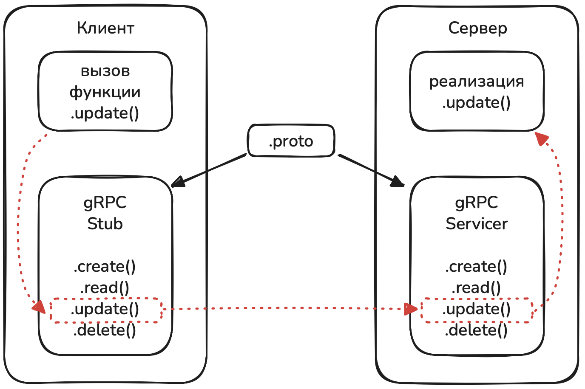

# gRPC

- [gRPC](#grpc)
  - [Описание](#описание)
  - [gRPC vs REST](#grpc-vs-rest)
  - [protobuf](#protobuf)
  - [Первый .proto файл](#первый-proto-файл)
    - [комментарии](#комментарии)
    - [proto2 vs proto3](#proto2-vs-proto3)
    - [Имя пакета](#имя-пакета)
    - [Нотация](#нотация)
    - [Нумерация полей (tag)](#нумерация-полей-tag)
    - [Имена сервисов/методов](#имена-сервисовметодов)
  - [Пакеты python](#пакеты-python)
  - [Генерация python-кода](#генерация-python-кода)
  - [Well-known типы данных](#well-known-типы-данных)
    - [Простые типы](#простые-типы)
    - [Сложные типы](#сложные-типы)
      - [Message](#message)
      - [Enum](#enum)
      - [oneof](#oneof)
      - [map](#map)
      - [repeated](#repeated)
  - [Клиент-сервер](#клиент-сервер)
    - [Простой сервер](#простой-сервер)
    - [Консольные утилиты](#консольные-утилиты)
    - [Простой клиент](#простой-клиент)
  - [Асинхронный gRPC](#асинхронный-grpc)
    - [ServicerContext](#servicercontext)
      - [Metadata](#metadata)
      - [keepalive](#keepalive)
  - [Интерцепторы](#интерцепторы)
  - [Типы вызовов RPC в gRPC](#типы-вызовов-rpc-в-grpc)
  - [Рефлексия](#рефлексия)

## Описание

RPC - Remote Procedure Call - удаленный вызов процедуры, когда клиент вызывает некоторую отдельную функцию на сервере, а потом использует результаты её работы. Основная идея в том, что методы вызываются клиентом так, как будто бы они являются локальными для него и он вообще не знает, что существует сервер, вся сложность сетевого взаимодействие клиент-сервер скрывается.

gRPC это высокопроизводительный framework от google для работы с RPC. gRPC использует протокол HTTP/2 для транспорта и Protocol Buffers (protobuf) для сериализации данных и предоставляет ряд возможностей, например:

- автоматическая генерация кода на основе protobuf
- работа с большинством языков и платформ
- сжатие и мультиплексирования данных
- поддержка потоков данных, в т.ч. и двунаправленных
- позволяет микросервисам взаимодействовать с низкой задержкой и небольшим сетевым трафиком
- определяет строгую типизация API (контракты), что уменьшает ошибки интеграции систем

Недостаток: высокий порог входа и сложность.

## gRPC vs REST

| Особенность | REST (HTTP/JSON) | gRPC (HTTP/2 + Protobuf) |
| - | - | - |
| Транспорт | HTTP/1.1 | HTTP/2 |
| Формат данных | JSON (текстовый, более тяжёлый) | Protocol Buffers (компактный бинарный) |
| Производительность | Средняя, больше трафика | Высокая, меньший размер сообщений |
| Контракты API | Документация, OpenAPI/Swagger | Строго типизированные `.proto` файлы |
| Стриминг | Нет | Есть, в т.ч. в обе стороны |
| Поддержка микроcервисов | Возможна, но без встроенной схемы  | Оптимальная, контракт между сервисами строго определён |

## protobuf

protobuf это язык описания данных и механизм сериализации, разработанный google.

Основная идея:

- описываем формат данных в специальном .proto файле
- с помощью компилятора protoc генерируете код под нужный язык программирования
- работаем с типами как с обычными классами/структурами, не заботясь о том, как данные переводятся в бинарный формат и передаются по сети

Основные понятия:

- типы данных: есть примитивы (int32, string, bool и др.) и сложные типы (enum, repeated и др.)
- поле (field): аналог атрибута в классе python. Имеют имя, тип и уникальный номер (tag). Имя используется в коде, а номер нужен для сериализации
- сообщение (message): контейнер для полей, аналог класса в python
- сервис (service): описание rpc функций (методов), которое задает имя метода, входное сообщение, выходное сообщение. Сервисы используются в gRPC

Данные сохраняются в файлах с расширением `.proto`

- [Документация](https://protobuf.dev)
- Общий [github](https://github.com/protocolbuffers/protobuf)
- для [python](https://github.com/protocolbuffers/protobuf/tree/main/python) в частности.

## Первый .proto файл

Структура proto-файла на примере:

```proto
// версия синтаксиса
syntax = "proto3";

// имя пакета
package app.ping;

// входящее сообщение (аргументы функции)
message PingRequest{
    string target = 1;
}
// выходящее сообщение (результат работы функции)
message PingReply{
    bool ok = 1;
}

// описание сервиса Ping
service PingService {
    // одна ручка Ping
    rpc Ping (PingRequest) returns (PingReply);
}
```

### комментарии

```proto
// однострочный комментарий

package ping;  // inline комментарий

/*
многострочный
комментарии
*/
```

Лучше использовать однострочные отдельные комментарии, так как они сгенерированный на базе proto-файла код.

### proto2 vs proto3

Существует две версии синтаксиса, proto3 является упрощением proto2. Убраны некоторые конструкции (например указание обязательных/опциональных полей), значение по-умолчанию не отправляется др. В целом proto2 и proto3 совместимы между собой на уровне сообщений и то, что было сериализовано proto2 можно прочитать proto3. На этапе знакомства зафиксируем proto3 как используемый синтаксис и дальше отличия от proto2 рассматриваться не будут.

### Имя пакета

используется как пространство имен, что бы избежать конфликтов при совпадении названий rpc методов. Кроме этого полное имя сервиса, объявленного в proto файле складывается как

```text
<package>.<ServiceName>/<MethodName>
```

Которое может использоваться для организации логической структуры API.

Принято использовать snake_case + можно добавить версионирование (v1, v2).
В сгенерированном Python-коде package превращается в путь модуля.

### Нотация

По соглашению имена сообщений/сервисов пишется в PascalCase нотации

```proto
// правильно
message PingRequest{
    string target = 1;
}

// неправильно
message ping_request{
    string target = 1;
}
```

### Нумерация полей (tag)

Использовать 0 нельзя, это зарезервированное значение, можно начинать с 1. Если полей несколько, можно оставлять зазор для дальнейшего расширения, т.е. порядок не обязательно непрерывный.

```proto
message PingRequest{
    string target = 10;
    string msg = 20;
}
```

Кроме этого для уже выпущенного api нельзя менять номера (что бы не сломалось совместимость). Можно зарезервировать номера и имена полей, например уже удаленных (что бы не забыть) или под будущее расширение.

```proto
message User {
  reserved 2, 4 to 6;
  reserved "tmp", "temp";
  string name = 1;
}
```

### Имена сервисов/методов

Имена методов и сервисов могут совпадать, но это может вносить путаницу. Обычно имена сервисов делают существительными, а методов - глаголами (как имена классов/методов в python).

```proto
service PingService {
    rpc Ping (PingRequest) returns (PingReply);
}
```

## Пакеты python

Для компиляции и работы с proto файлами (и grpc в целом) нужны пакеты:

master группа `poetry add grpcio protobuf`:

- `grpcio` — основной пакет gRPC (runtime)
- `protobuf` — поддержка protobuf сообщений в python

dev группа `poetry add --dev grpcio-tools mypy-protobuf`:

- `grpcio-tools` — компилятор protobuf в python
- `mypy-protobuf` — генератор stub файлов (.pyi файлы)
- `grpc-stubs` - stub файлы

## Генерация python-кода

```text
python -m grpc_tools.protoc \
  --proto_path=./proto \
  --python_out=./pb \
  --grpc_python_out=./pb \
  --mypy_out=./pb \
  ./proto/ping.proto
```

Опции

- `python -m grpc_tools.protoc` - сам компилятор
- `--proto_path=./proto` - каталог для поиска импортов, можно указывать несколько раз (если несколько папок), есть короткая запись `-I=./proto`
- `--python_out=./pb` - куда складывать python код
- `--grpc_python_out=./pb` - куда складывать grpc python код (сервер/клиент)
- `--mypy_out=./pb` - куда складывать mypy stub файлы (pyi), эта опция обеспечивается пакетом `mypy-protobuf`. Есть альтернатива в виде опции `--pyi_out` из коробки (дополнительный пакет не нужен), но `--mypy_out` точнее генерирует stub файлы
- `./proto/ping.proto` - сам proto файл, на базе которого будем генерировать код

Запуск команды выше приводит к генерации трех файлов в каталоге ./pb (каталог предварительно создать нужно)

```text
├── app
│   ├── main.py
├── pb
│   ├── ping_pb2_grpc.py
│   ├── ping_pb2.py
│   └── ping_pb2.pyi
└── proto
    └── ping.proto
```

ping_pb2.py в нашем случае описывает два класса: PingReply и PingReply. Использовать в коде их можно как и обычные python объекты, импортировав нужный модуль:

```python
# main.py
from pb import ping_pb2

reply = ping_pb2.PingReply()
```

Используется proto3 синтаксис, поэтому все аргументы являются опциональными и их можно не передавать в init, а назначать позже.
Кроме этого поля имеют значение по-умолчанию нулевое (или эквивалент, например для bool это False, для string это пустая строка `""`) которое не передается по сети.

Некоторые методы/атрибуты, присутствующие по-умолчанию:

- `.IsInitialized()` - проверяет, инициализированы ли обязательные поля, для proto3 всегда вернет True (так как там не обязательных полей), а для proto2 метод актуален
- `.Clear()` - сбрасывает сообщение, очищая все поля
- `.ClearField()` - сбрасывает только одно указанное поле
- `.CopyFrom()` - копирует данные из другого сообщения
- `.MergeFrom()` - объединяет свои значение и значения из другого сообщения
- `.SerializeToString()` - сериализация в бинарный формат, фактически то, что будет отправлено по сети
- `.ParseFromString()` - десериализация данных из бинарного формата в python объект
- `.ByteSize()` - возвращает размер сериализованного сообщения
- `.ListFields()` - список установленных полей в виде (поле, значение)
- `.DESCRIPTOR` - метаданные о сообщении (имя, поля, теги, типы), нужно в том числе для рефлекции (об этом позже)

Значения по умолчанию для proto3:

```python
reply = ping_pb2.PingReply()
reply.ok
# >> False

reply.ByteSize()
# >> 0

reply.SerializeToString()
# >> b''
```

Данные можно сериализовать в файл:

```python
request = ping_pb2.PingRequest(target="привет", ok=True)
with open("msg.bin", "wb") as f:
    f.write(request.SerializeToString())
```

и затем обратно десериализовать из файла:

```python
restored = ping_pb2.PingRequest()
with open("msg.bin", "rb") as f:
    restored.ParseFromString(f.read())
print(restored.target)
print(restored.ok)
```

DESCRIPTOR позволяет получить метаданные как о самом сообщении, так и о его полях:

```python
for field in request.DESCRIPTOR.fields:
    print("-" * 20)
    print(f"name   : {field.name}")
    print(f"tag    : {field.number}")
    print(f"type   : {field.type}")
    print(f"default: {field.default_value!r}")
```

## Well-known типы данных

### Простые типы

| Protobuf тип | Python тип | Примечания |
| - | - | - |
| `double` / `float` | `float` | 64/32-битное число с плавающей точкой |
| `int64` / `int32` | `int` | 64/32-битное целое целое |
| `bool` | `bool` | `True` / `False` |
| `string` | `str` | UTF-8 |
| `bytes` | `bytes` | бинарные данные |

есть еще `uint64/32`, `sint64/32` и другие целочисленные, это все `int` в python

### Сложные типы

| Protobuf тип | Python тип | Примечания |
| - | - | - |
| `message` | Класс | Доступ к полям как к атрибутам |
| `enum` | Класс с именованными `int` константами | |
| `oneof` | Группа полей внутри `message` | В Python хранится как обычные атрибуты, но активно только одно |
| `map<K,V>` | `dict[K, V]` | Ключи `int64/32` или `string` |

#### Message

Транслируется в python класс и может содержать как просто набор полей (атрибуты в python) так и другие составные типы, например один message или enum может находиться внутри message.

```proto
message Address {
  string city = 1;
  string street = 2;
}

message User {
  string name = 1;
  int32 age = 2;
  Address address = 3;
}

message Response {
  message Result {
    bool ok = 1;
    int32 code = 2;
  }
  Result status = 1;
  string text = 2;
}
```

Аналог в python (упрощенный):

```python
class Address:
    city: str
    street: str

class User:
    name: str
    age: int

    @property
    def address(self) -> Address: ...


class Response:
    class Result:
        ok: bool
        code: int

    text: str

    @property
    def result(self) -> Result: ...
```

После генерации можно использовать в python как:

```python
from pb import message_pb2

address = message_pb2.Address()
address.city = "msk"
address.street = "unknown"
user = message_pb2.User(
    name="john",
    age=30,
    address=address,
)

# name: "john"
# age: 30
# address {
#   city: "msk"
#   street: "unknown"
# }
```

#### Enum

enum - набор именованных целочисленных констант.

```proto
enum Status {
  STATUS_DEFAULT = 0;
  STATUS_OK = 1;
  STATUS_FAIL = 2;
  STATUS_TIMEOUT = 3;
}
```

Особенности:

- каждая константа это пара `имя-число`
- первое значение должно быть 0 и оно используется как unspecified или default значение
- дальше числа могут идти как угодно, главное, что бы они были уникальны в рамках одного enum
- enum используется как типа поля (т.е. вместо string/bool/...)
- enum можно создать сразу внутри сообщения
- при генерации в python такой enum становится обычным классом с набором констант

```python
from pb import enum_pb2

print(enum_pb2.Status.STATUS_FAIL)
# >> 2
print(enum_pb2.Status.STATUS_OK)
# >> 1
```

#### oneof

это группа полей, в которой может быть установлено только одно значение.

```proto
message Event {
  oneof payload {
    string text = 1;
    int32 code = 3;
  }
}
```

использование в python коде. Назначение значения в любом поле из группы oneof автоматически очищает все остальные поля из этой группы.

```python
from pb import oneof_pb2

event = oneof_pb2.Event()

event.text = "hello"
print(f"{event.text!r}")
# 'hello'
print(f"{event.code!r}")
# 0
print(f"{event.WhichOneof("payload")}")
# 'text'

event.code = 404
print(f"{event.text!r}")
# ''
print(f"{event.code!r}")
# 404
print(f"{event.WhichOneof("payload")}")
# 'code'
```

#### map

Это массив (словарь)

```proto
message Platform {
  map<string, string> scrapli = 1;
}
```

```python
from pb import map_pb2

platform = map_pb2.Platform()
platform.scrapli["cisco"] = "cisco_iosxe"
print(platform)
# scrapli {
#   key: "huawei"
#   value: "huawei_vrp"
# }
platform.scrapli["huawei"] = "huawei_vrp"
print(platform)
# scrapli {
#   key: "huawei"
#   value: "huawei_vrp"
# }
# scrapli {
#   key: "cisco"
#   value: "cisco_iosxe"
# }

# методы работы аналогично методам словаря
platform.scrapli.get("huawei")
platform.scrapli.pop("huawei")
platform.scrapli.clear()
platform.scrapli.items()
platform.scrapli.values()
platform.scrapli.keys()
```

#### repeated

это не тип данных, а модификатор, оборачивающие поле в список в котором может храниться 0 или более элементов.

```proto
message Devices {
    string site = 1;
    repeated string ip = 2;
}
```

```python
from pb import repeated_pb2

devices = repeated_pb2.Devices()
devices.ip.append("1.2.3.4")
devices.ip.append("4.3.2.1")
devices.ip.extend(["1.1.1.", "2.2.2.2"])
print(devices)
# site: "msk"
# ip: "1.2.3.4"
# ip: "4.3.2.1"
# ip: "1.1.1."
# ip: "2.2.2.2"
```

## Клиент-сервер

После написания proto файла и генерации python кода в файлах "*_pb2_grpc.py" содержится классы для организации сетевого взаимодействия. Для клиента создается Stub (класс-обертка) который скрывает механизм взаимодействия клиент-сервер и позволяет делать вызов функции как вызов обычного локального метода. Для сервера создается Servicer - абстрактный класс, описывающий методы, необходимые к реализации.

<p align="center"></p>

### Простой сервер

Для реализации сервера используется grpc runtime библиотека для организации межсетевого взаимодействия.

```python
from concurrent import futures

import grpc
from pb import ping_pb2, ping_pb2_grpc


class PingService(ping_pb2_grpc.PingServiceServicer):
    def Ping(  # noqa: N802
        self,
        request: ping_pb2.PingRequest,
        context: grpc.ServicerContext,
    ) -> ping_pb2.PingReply:
        print(f"новый запрос: {request.target}")
        return ping_pb2.PingReply(ok=True)


def serve() -> None:
    server = grpc.server(futures.ThreadPoolExecutor(max_workers=10))
    ping_pb2_grpc.add_PingServiceServicer_to_server(PingService(), server)

    server.add_insecure_port("[::]:50051")
    print("gRPC сервер запущен на порту 50051")
    server.start()
    server.wait_for_termination()


if __name__ == "__main__":
    serve()
```

### Консольные утилиты

Проверить работоспособность сервера можно консольными утилитами (или Postman - [гайд на хабре](https://habr.com/ru/companies/otus/articles/699616/)).

- [grpcurl](https://github.com/fullstorydev/grpcurl)
- [grpc_cli](https://grpc.github.io/grpc/core/md_doc_command_line_tool.html)

Пример вызова через grpcurl:

```text
grpcurl \
  -plaintext \
  -import-path <путь к папке с proto файлом> \
  -proto ping.proto \
  -d '{"target": "example.com"}' \
  localhost:50051 app.ping.v1.PingService/Ping
```

Пример вызова через grpc_cli:

```text
grpc_cli call \
  localhost:50051 \
  app.ping.v1.PingService.Ping '{"target": "example.com"}' \
  --proto_path /Users/alexigna/projects/python2025-bkp/c20_grpc/src/s03_simple_client_server/proto \
  --protofiles ping.proto \
  --json_input \
  --json_output
```

### Простой клиент

Простой синхронный клиент:

```python
import grpc

from c20_grpc.src.s03_simple_client_server.app.pb import ping_pb2, ping_pb2_grpc

channel = grpc.insecure_channel("localhost:50051")
stub = ping_pb2_grpc.PingServiceStub(channel)

response = stub.Ping(ping_pb2.PingRequest(target="example.com"))
print(response)

channel.close()
```

либо тоже самое, но через контекстный менеджер:

```python
with grpc.insecure_channel("localhost:50051") as channel:
    stub = ping_pb2_grpc.PingServiceStub(channel)
    response = stub.Ping(ping_pb2.PingRequest(target="example.com"))
    print(response)
```

## Асинхронный gRPC

Асинхронные клиент и сервер предоставляются модулем `grpc.aio`. При этом названия остаются теми же самыми, но являются корутинами, а не обычными функциями:

```python
# сервер
server = grpc.aio.server()
await server.start()
await server.wait_for_termination()
await server.stop(5)

# клиент
async with grpc.aio.insecure_channel(...) as channel:
    stub = ...
    response = await stub.Ping(...)
```

Для организации работы удобно разделить логику приложения и сервера как минимум на отдельные классы:

```python
# логика отдельно
class PingHandler:
    async def handle(self, target: str) -> tuple[bool, str]:
        await asyncio.sleep(randint(50, 200) / 100)
        log.info(f"запрос '{target}' обработан")
        return True, f"ответ на запрос '{target}'"


# gRPC сервер отдельно
class PingService(ping_pb2_grpc.PingServiceServicer):
    def __init__(self, handler: PingHandler) -> None:
        self.handler = handler

    async def Ping(  # noqa: N802
        self,
        request: ping_pb2.PingRequest,
        context: grpc.aio.ServicerContext,
    ) -> ping_pb2.PingReply:
        log.info(f"новый запрос: '{request.target}'")
        ok, msg = await self.handler.handle(request.target)
        return ping_pb2.PingReply(ok=ok, msg=msg)


async def main() -> None:
    # асинхронный сервер доступен в модуле grpc.aio
    server = grpc.aio.server()

    # регистрируем сервис
    ping_pb2_grpc.add_PingServiceServicer_to_server(PingService(PingHandler()), server)
    server.add_insecure_port("[::]:50051")
    log.info("gRPC сервер запущен на порту 50051")

    # запуск
    await server.start()

    try:
        await server.wait_for_termination()
    except asyncio.CancelledError:
        log.info("Остановка сервера…")
        # 5 секунд на graceful shutdown
        await server.stop(5)
```

При работе с сервером мы можем применять все уже знакомые техники работы с async кодом, например что бы ограничить количество одновременно выполняемых корутин можем применять semaphore:

```python
semaphore = asyncio.Semaphore(10)

class PingService(ping_pb2_grpc.PingServiceServicer):
    async def Ping(  # noqa: N802
        self,
        request: ping_pb2.PingRequest,
        context: grpc.aio.ServicerContext,
    ) -> ping_pb2.PingReply:
        async with semaphore:
            log.info(f"новый запрос: '{request.target}'")
            ok, msg = await self.handler.handle(request.target)
            return ping_pb2.PingReply(ok=ok, msg=msg)
```

или queue и workers:

### ServicerContext

`grpc.ServicerContext` - синхронный
`grpc.aio.ServicerContext` - асинхронный

При вызове RPC на сервере запрос проходит три основные стадии

- приём по сети
- десериализация
- вызов соответствующей корутины сервиса (определенной в Servicer'е)

В вызываемую корутину помимо самого десериализованного запроса передается контекст вызова - объект, содержащий служебные данные, методы управление запросом и каналом (API для управления RPC на сервере), который позволяет:

- читать данные о клиенте
- работать с метаданными (получить/установить)
- контролировать время жизни RPC (таймауты)
- прерывать вызов с нужным статусом
- обеспечивает двустороннюю связь между клиентом и сервером

Объект контекста живет столько, сколько живет сам RPC вызов и он уникален на каждый вызов.

Например, что бы прервать запрос на стороне сервера можно использовать конструкцию вида:

```python
context.set_code(code=grpc.StatusCode.RESOURCE_EXHAUSTED)
context.set_details(details="сервер перегружен")
return ping_pb2.PingReply(ok=False, msg="очередь переполнена")
```

или

```python
await context.abort(
    code=grpc.StatusCode.RESOURCE_EXHAUSTED,
    details="сервер перегружен",
)
```

Для async варианта оба подхода будут означать исключение AioRpcError в месте вызова RPC:

```python
try:
    result = await stub.Ping(ping_pb2.PingRequest(...))
except grpc.aio.AioRpcError:
    ...
```

Можно выделить три основные группы:

- управление: `.set_code`, `.set_details`, `.abort`
- метаданные: `.invocation_metadata()`, `.set_trailing_metadata()`, `.send_initial_metadata()`
- состояние соединения: `.done()`, `.cancelled()`, `.time_remaining()`

#### Metadata

Это HTTP/2 заголовки, которые передаются вместе с запросом и ответом. Есть три типа:

- Initial — отправляется при начале rpc. Формируются автоматически, но можно и руками сделать (send_initial_metadata), но только один раз
- Trailing — отправляется при завершении rpc. Как и initial - формируются автоматически, но можно руками установить (set_trailing_metadata)
- Invocation - то, что отправляет клиент в сторону сервера при вызове rpc.

Клиент отсылает:

```python
result = await stub.Ping(
    request=ping_pb2.PingRequest(
        target=f"test-{num:02}",
        delay=num,
    ),
    metadata=[("request-id", "abc-42")],
)
```

Сервер получает:

```python
for key, value in context.invocation_metadata():
    print(f"{key}={value}")
```

#### [keepalive](https://grpc.io/docs/guides/keepalive/)

grpc работает поверх HTTP/2, поэтому существует возможность настройки keepalive pings, которые позволяют серверу понять, что клиент больше не доступен.

```python
server = grpc.aio.server(
    options=[
        ('grpc.http2.min_ping_interval_without_data_ms', 1000),
        ('grpc.http2.min_ping_strikes', 3),
        ('grpc.keepalive_permit_without_calls', 1),
        ('grpc.keepalive_timeout_ms', 10000),
    ]
)
```

| Опция | Описание |
| - | - |
| `grpc.http2.min_ping_interval_without_data_ms` | минимальный интервал между ping без активности |
| `grpc.http2.min_ping_strikes` | сколько неудачных ping подряд нужно получить, чтобы разорвать соединение |
| `grpc.keepalive_permit_without_calls` | разрешает серверу ping клиенту даже если нет текущих RPC |
| `grpc.keepalive_time_ms` | интервал, через который сервер отправляет HTTP/2 PING, если нет активности |
| `grpc.keepalive_timeout_ms` | время ожидания PONG от клиента |

keepalive работает активно со стороны сервера, если клиент перестает отвечать, то сервер понимает это и бросает CancelledError.

## Интерцепторы

Интерцепторы это как middleware в REST (FastAPI/Django/...) — специальные перехватчики вызовов, находящиеся между приложением (нашей реализацией бизнес-логики) и grpc рантаймом. Интерцепторы могут вмешаться в жизненный цикл вызова: изменить, добавить/менять хедеры, делать проверки или отклонить запрос до того, как управление дойдёт до реализации бизнес-логики.

Интерцепторы применяются для:

- логирования / добавления request-id
- сбора метрики
- аутентификации / авторизации
- других централизованных вспомогательных задач

Интерцепторы разделяют на клиентские и серверные:

- клиентские - нужны что бы обогащать и контролировать исходящие вызовы, работают до того, как вызов уйдет на сервер. Там можем добавить токен в хедер, сделать логирование, установить таймауты, сделать кеширование и пр.  
- серверные - нужны что бы фильтровать, контролировать и проверять входящие вызовы, работают между получением вызова и передачей его в обработчик RPC метода. Там можем делать проверки аутентификации/авторизации, организации rate-limiter'a, логирование/метрики.  

Простой интерцептор для логирования запросов на стороне сервера:

```python
from grpc.aio import ServerInterceptor
from grpc import HandlerCallDetails, RpcMethodHandler
# определение:
class LoggingServerInterceptor(ServerInterceptor):
    async def intercept_service(
        self,
        continuation: Callable[[HandlerCallDetails], Awaitable[RpcMethodHandler]],
        handler_call_details: HandlerCallDetails,
    ) -> RpcMethodHandler:
        log.debug(f"[SERVER] method={handler_call_details.method}, metadata={handler_call_details.invocation_metadata}")
        return await continuation(handler_call_details)

# назначение на сервер:
server = grpc.aio.server(
    interceptors=[
        LoggingServerInterceptor(),
    ],
)
```

- `ServerInterceptor` - базовый класс для серверного интерцептора
- `intercept_service` - абстрактный метод, любой серверный интерцептор должен его реализовать
- `continuation` - функция которая передает управление дальше по цепочке интерцепторов до тех пор, пока не дойдет до реального обработчика rpc запроса, который знает, какой метод Servicer'а вызвать для обработки запроса.
- `handler_call_details` - описывает данные о входящем rpc вызове. При этого самого тела запроса нет, только endpoint (имя метода) и метаданные

Аналогичный интерцептор на стороне клиента:

```python
class LoggingClientInterceptor(UnaryUnaryClientInterceptor):
    async def intercept_unary_unary(
        self,
        continuation: Callable[[ClientCallDetails, Message], Awaitable[Call]],
        client_call_details: ClientCallDetails,
        request: Message,
    ) -> Message:
        log(
            f"[CLIENT] запрос, method={client_call_details.method}, "
            f"metadata={client_call_details.metadata}, "
            f"request={request}",
        )
        call = await continuation(client_call_details, request)
        response = await call
        initial_metadata = await call.initial_metadata()
        trailing_metadata = await call.trailing_metadata()

        log(f"[CLIENT] ответ, method={client_call_details.method}: {initial_metadata=}")
        log(f"[CLIENT] ответ, method={client_call_details.method}: {trailing_metadata=}")
        log(f"[CLIENT] ответ, method={client_call_details.method}: {response=}")

        return response
```

- `UnaryUnaryClientInterceptor` - базовый класс для клиентского интерцептора
- `client_call_details` - описывает данные об исходящем rpc вызове. Содержит rpc метод/метаданные
- `continuation` - функция которая передает управление дальше по цепочке интерцепторов до тех пор, пока запрос не будет отправлен. При этом функция возвращает объект Call, ожидая который можно получить сам ответ.

## Типы вызовов RPC в gRPC

Существуют 4 типа rpc вызовов:

| Тип RPC | Запросы | Ответы | Где применять |
| - | - | - | - |
| Unary | 1 | 1 | простые CRUD команды |
| Server streaming | 1 | n | логи, телеметрия, подписки |
| Client streaming | n | 1 | загрузка данных, агрегация сообщений |
| Bidirectional | n | n | чат, звонки, интерактив |

unary - наиболее простой и понятный тип вызова, до этого в примерах только он и использовался. Клиент отправляет один запрос, сервер отправляет один ответ на него. Аналог обычному REST запросу.

server streaming - клиент отправляет один запрос, сервер в ответ начинает возвращать поток сообщений. Самый понятный пример - gNMI телеметрия, клиент подписывается на какую-то статистику одним запросом, сервер (сетевое устройство) начинает передавать эту статистику с заданным sample интервалом.

client streaming - обратная ситуация, клиент отправляет поток сообщений, а от сервера в итоге придет только одно сообщение в ответ. Таким образом можно сделать, например, загрузку данных на сервер: клиент в дробит данные на части и отсылает их потоком, а сервер по завершению приема делает обработку данных и отсылает результат одним сообщением.

bidirectional streaming - поток в две стороны: и сервер и клиент шлют друг другу потоки сообщений, подходит для чатов, конференций и пр.

потоковый обмен сообщениями в grpc.aio реализуется через асинхронные итераторы, что позволяет использовать конструкции вида `async for <msg> in <request_iterator>`.

в proto файлах для обозначения потоковой передачи добавляется ключевое слово `stream`:

```proto
service ChatService {
  rpc Chat (stream ChatMessage) returns (stream ChatMessage);
}
```

В коде мы переходим на AsyncIterator из которого извлекаются сообщения. Для сервера это выглядит как:

```python
class ChatService(chat_pb2_grpc.ChatServiceServicer):
    async def Chat(  # noqa: N802
        self,
        request_iterator: AsyncIterator[ChatMessage],
        context: ServicerContext[ChatMessage, ChatMessage],
    ) -> AsyncIterator[ChatMessage]:
        async for message in request_iterator:
            log.info(f"{message.user=}, {message.msg=}")
            await asyncio.sleep(0.2)
            yield ChatMessage(
                user="Server",
                msg=message.msg[::-1],
            )
```

т.е. вместо `request` в виде десериализованного запроса в метод передается `request_iterator`, который является асинхронным итератором, выдающим очередное сообщение из потока от клиента. Так со стороны сервера тоже используется стриминговая отправка, то вместо return (как для unary типа) используется yield.

а для клиента так:

```python
async with grpc.aio.insecure_channel("localhost:50051") as channel:
    stub = chat_pb2_grpc.ChatServiceStub(channel)
    async for response in stub.Chat(generate_messages()):
        pass
```

т.е. вместо `result = await stub.Chat(<MSG>)` в метод передается асинхронный генератор для того, что бы отправить серверу стрим из сообщений, которые будут выданы этим генератором. А так как ответ сервера это тоже поток, то обрабатывается от через async for (аналогично, как на сервере обрабатываются стрим сообщений от клиента).

## Рефлексия

это механизм, позволяющий клиентам получать информацию о доступных сервисах, методах и сообщениях на сервере без необходимости иметь локальные .proto файлы. Это делает возможным динамическое создание клиентов и генерацию запросов без необходимости заранее компилировать .proto файлы.

Рефлексия реализована через отдельный сервис ServerReflection, предоставляющий стандартный интерфейс для запроса данных. Рефлексия не зависит от языка, версий библиотек или изменений в .proto файлах. Она не требует модификации бизнес-логики сервиса и полностью изолирована от основной реализации.

Для работы необходимо установить пакет

```text
poetry add grpcio-reflection
```

Рефлексию можно использовать через консольные утилиты, postman, или в реализации клиента.

- список сервисов  

    ```text
    ~ grpcurl -plaintext localhost:50051 list
    app.hello.v1.HelloService
    grpc.reflection.v1alpha.ServerReflection
    ```

- методы сервиса

    ```text
    ~ grpcurl -plaintext localhost:50051 list app.hello.v1.HelloService
    app.hello.v1.HelloService.Hello
    ```

- типы запросов и ответов сервиса

    ```text
    ~ grpcurl -plaintext localhost:50051 describe app.hello.v1.HelloService
    app.hello.v1.HelloService is a service:
    service HelloService {
      rpc Hello ( .app.hello.v1.HelloRequest ) returns ( .app.hello.v1.HelloResponse );
    }
    ```

- описание сообщений

    ```text
    ~ grpcurl -plaintext localhost:50051 describe app.hello.v1.HelloRequest 
    app.hello.v1.HelloRequest is a message:
    message HelloRequest {
      string msg = 1;
      int32 delay = 2;
    }
    ```
